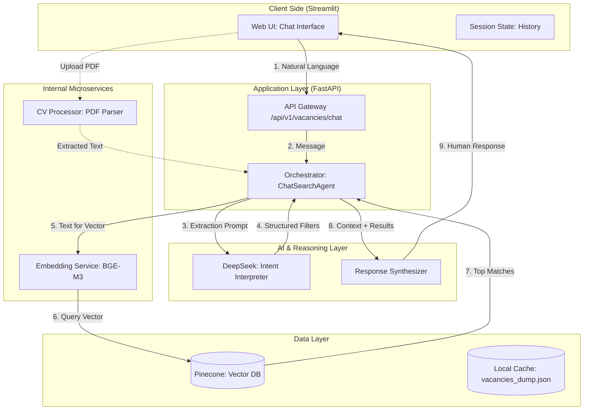

# Funds Search — Conversational Multi-Agent Job Matching

A microservice system that helps a candidate find and explain best-fit roles (VC / startup jobs) using:
- **LangGraph** orchestration
- **BGE-M3 embeddings**
- **Pinecone** vector search
- A small **agent fleet** (profiling → intent → matching → live scraping fallback)

> Repo goal: keep the UI conversational and the backend deterministic/traceable (schemas + clear agent boundaries).

---

## Quick Start (Docker)

### 1) Create `.env` (minimal)
```bash
PINECONE_API_KEY=...
PINECONE_INDEX_NAME=funds-search

# LLM providers (configure what you actually use)
DEEPSEEK_API_KEY=...

# Optional (only if Matchmaker uses them)
OPENAI_API_KEY=...
ANTHROPIC_API_KEY=...

# Optional: real-time job crawling
FIRECRAWL_API_KEY=...
```

### 2) Run
```bash
docker compose up -d --build
```

### 3) Access
- Web UI (Streamlit): http://localhost:8501  
- API (FastAPI): http://localhost:8000  
- OpenAPI docs: http://localhost:8000/docs

---

## System Design: Conversational AI Agent Architecture



---

## 📋 Agent Roles (The Agentic Fleet)

We avoid a single “all-knowing bot”. Each role is specialized, cheaper to run, and easier to debug.

| Agent | Role | Model (Provider) | What it does |
|------:|------|------------------|--------------|
| **Talent Strategist 🕵️‍♂️** | Profiler | **DeepSeek V3** (cheap/fast) | Parses CV / interview answers → extracts skills & preferences → produces a **UserPersona JSON** |
| **Job Scout 🛰️** | Intent Extractor | **DeepSeek R1** (reasoning) | Converts vague user intent (“like Google but in crypto”) → **structured filters + vector query** |
| **Matchmaker 🤝** | RAG Logic | **GPT-4o / Claude 3.5** | Takes top-K results → compares vs persona → explains why it’s a strong match (score + reasoning) |
| **Hunter Agent 🏹** | Real-time Scraper | **Firecrawl / APIs** | Wakes up if cache/DB is empty → fetches fresh jobs → returns items for indexing |

> Provider choice is configuration. The docs describe intent; your `.env` decides which providers are enabled.

---

## Repo Map (high level)

- `apps/api/` — FastAPI gateway (chat/search endpoints, diagnostics)
- `apps/orchestrator/` — LangGraph orchestration (agent flow + state)
- `apps/web-ui/` — Streamlit UI (chat + system diagnostics)
- `services/embedding-service/` — BGE-M3 embeddings (HTTP service)
- `services/cv-processor/` — PDF parsing + text extraction (HTTP service)
- `shared/` — shared schemas, clients, Pinecone helpers

---

## Docs (Deep Dives)

- Architecture: `docs/architecture.md`
- API reference: `docs/api.md`
- Deployment: `docs/deployment.md`
- Schemas: `docs/schemas.md`
- Troubleshooting: `docs/troubleshooting.md`
