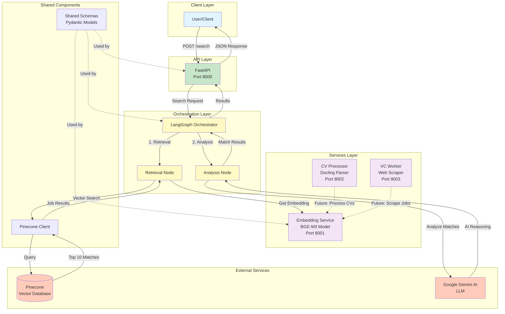

# funds-search

Multi-Agent RAG Framework for searching and matching job openings at VC funds.

## Architecture

This is a monorepo structure implementing a Multi-Agent RAG (Retrieval-Augmented Generation) system:

- **API** (`apps/api`): FastAPI application that exposes search endpoints
- **Orchestrator** (`apps/orchestrator`): LangGraph state machine for coordinating retrieval and analysis
- **Embedding Service** (`services/embedding-service`): BGE-M3 embedding model service
- **CV Processor** (`services/cv-processor`): Docling-based CV/resume parser
- **VC Worker** (`services/vc-worker`): Web scraper and job posting parser
- **Shared** (`shared`): Common schemas and utilities (Pinecone client)

### System Architecture Diagram



### Data Flow

1. **Search Request**: User sends a search query to the API endpoint (`POST /search`)
2. **Orchestration**: API forwards the request to the LangGraph Orchestrator
3. **Retrieval Node**:
   - Calls Embedding Service to generate query embedding using BGE-M3 model
   - Searches Pinecone vector database for top 10 similar job postings
   - Applies optional filters (location, remote, etc.)
4. **Analysis Node**:
   - For each retrieved job, sends context to Google Gemini AI
   - Gemini generates detailed reasoning about match quality
   - Combines similarity scores with AI-generated explanations
5. **Response**: Returns ranked list of `MatchResult` objects with scores and reasoning

## Tech Stack

- **Python**: 3.10+
- **Embedding Model**: BAAI/bge-m3 (Hugging Face)
- **Orchestration**: LangChain/LangGraph
- **LLM**: Google Gemini (Main Analyst)
- **Vector DB**: Pinecone
- **Parsing**: Docling (for Markdown conversion)
- **API Framework**: FastAPI

## Prerequisites

- Python 3.10 or higher
- Docker and Docker Compose (for containerized deployment)
- Environment variables:
  - `PINECONE_API_KEY`: Your Pinecone API key
  - `GOOGLE_API_KEY`: Your Google Gemini API key

## Running Locally

### Using Python venv

1. Create a virtual environment:
   ```bash
   python -m venv .venv
   source .venv/bin/activate  # On Windows: .venv\Scripts\activate
   ```

2. Install dependencies:
   ```bash
   pip install -r requirements.txt
   ```

3. Set environment variables:
   ```bash
   export PINECONE_API_KEY=your_pinecone_key
   export GOOGLE_API_KEY=your_google_key
   export EMBEDDING_SERVICE_URL=http://localhost:8001
   ```

4. Run the API service:
   ```bash
   uvicorn apps.api.main:app --host 0.0.0.0 --port 8000
   ```

5. In a separate terminal, run the embedding service:
   ```bash
   uvicorn services.embedding-service.main:app --host 0.0.0.0 --port 8001
   ```

6. Test the health endpoint:
   ```bash
   curl http://localhost:8000/health
   ```

### Using Docker Compose

1. Create a `.env` file with your API keys:
   ```bash
   PINECONE_API_KEY=your_pinecone_key
   GOOGLE_API_KEY=your_google_key
   ```

2. Build and run all services:
   ```bash
   docker-compose up --build
   ```

3. Test the health endpoint:
   ```bash
   curl http://localhost:8000/health
   ```

## API Endpoints

### Main API (Port 8000)

- `GET /health` - Health check endpoint
- `POST /search` - Search for job openings at VC funds
  - Request body:
    ```json
    {
      "query": "software engineer",
      "location": "San Francisco",
      "role": "engineer",
      "remote": true,
      "user_id": "optional_user_id"
    }
    ```
  - Response: List of `MatchResult` objects with scores and AI-generated reasoning

### Embedding Service (Port 8001)

- `GET /health` - Health check endpoint
- `POST /embed` - Generate embeddings for texts
  - Request body:
    ```json
    {
      "texts": ["text to embed", "another text"]
    }
    ```

### CV Processor (Port 8002)

- `GET /health` - Health check endpoint
- `POST /process` - Process CV/resume file (PDF or DOCX)

### VC Worker (Port 8003)

- `GET /health` - Health check endpoint
- `POST /scrape` - Scrape and parse job posting from URL

## Project Structure

```
/funds-search
├── .github/workflows/
│   └── deploy-embedding.yml      # CI/CD for Azure Container Apps
├── apps/
│   ├── api/                      # FastAPI main application
│   │   └── main.py
│   └── orchestrator/             # LangGraph orchestration
│       └── graph.py
├── services/
│   ├── cv-processor/             # Docling CV processing
│   │   └── main.py
│   ├── vc-worker/                # Web scraper + Docling
│   │   └── main.py
│   └── embedding-service/        # BGE-M3 Service
│       └── main.py
├── shared/
│   ├── schemas.py                # Pydantic models
│   └── pinecone_client.py        # Vector DB client
├── docker-compose.yml
├── Dockerfile
├── requirements.txt
└── README.md
```

## How It Works

1. **Search Request**: User sends a search query to the API
2. **Orchestrator**: LangGraph state machine coordinates the process:
   - **Retrieval Node**: Generates query embedding using BGE-M3, searches Pinecone for top 10 matches
   - **Analysis Node**: Gemini AI agent analyzes each match and generates reasoning
3. **Response**: Returns ranked results with similarity scores and AI-generated explanations

## CI/CD

The project includes GitHub Actions workflow for deploying the embedding service to Azure Container Apps. See `.github/workflows/deploy-embedding.yml` for details.

## Development

To add new features:

1. Update schemas in `shared/schemas.py` if needed
2. Add new nodes to the orchestrator in `apps/orchestrator/graph.py`
3. Update API endpoints in `apps/api/main.py`
4. Add tests as needed

## License

See LICENSE file for details.
