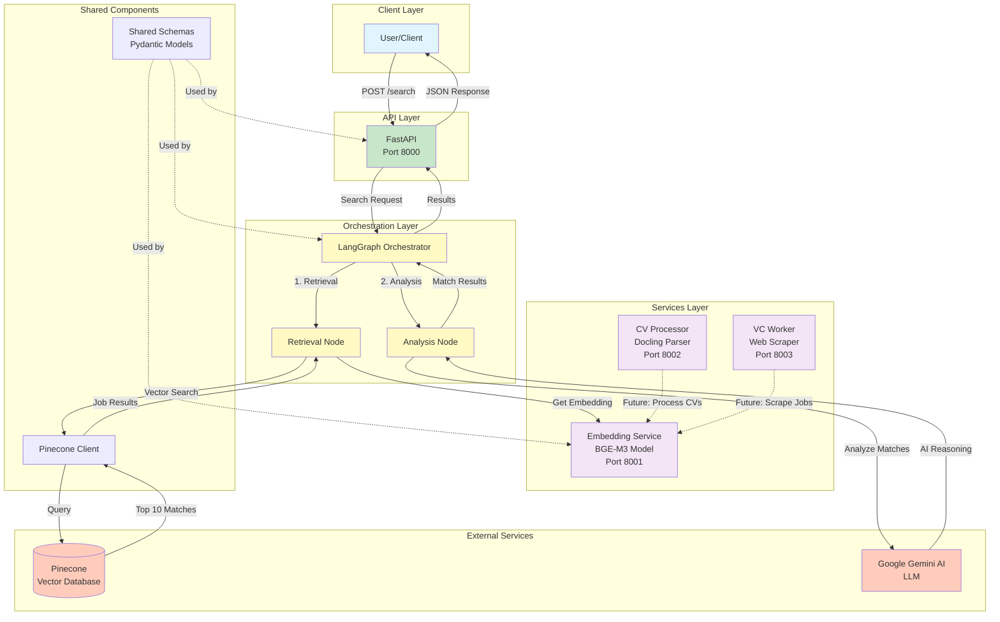

# funds-search

Multi-Agent RAG Framework for searching and matching job openings at VC funds.

## Architecture

This is a monorepo structure implementing a Multi-Agent RAG (Retrieval-Augmented Generation) system:

- **API** (`apps/api`): FastAPI application that exposes search endpoints
- **Orchestrator** (`apps/orchestrator`): LangGraph state machine for coordinating retrieval and analysis
- **Embedding Service** (`services/embedding-service`): BGE-M3 embedding model service
- **CV Processor** (`services/cv-processor`): Docling-based CV/resume parser
- **VC Worker** (`services/vc-worker`): Web scraper and job posting parser
- **Shared** (`shared`): Common schemas and utilities (Pinecone client)

### System Architecture Diagram



### Data Flow

1. **Search Request**: User sends a search query to the API endpoint (`POST /search`)
2. **Orchestration**: API forwards the request to the LangGraph Orchestrator
3. **Retrieval Node**:
   - Calls Embedding Service to generate query embedding using BGE-M3 model
   - Searches Pinecone vector database for top 10 similar job postings
   - Applies optional filters (location, remote, etc.)
4. **Analysis Node**:
   - For each retrieved job, sends context to Google Gemini AI
   - Gemini generates detailed reasoning about match quality
   - Combines similarity scores with AI-generated explanations
5. **Response**: Returns ranked list of `MatchResult` objects with scores and reasoning

## Tech Stack

- **Python**: 3.10+
- **Embedding Model**: BAAI/bge-m3 (Hugging Face)
- **Orchestration**: LangChain/LangGraph
- **LLM**: Google Gemini (Main Analyst)
- **Vector DB**: Pinecone
- **Parsing**: Docling (for Markdown conversion)
- **API Framework**: FastAPI

## Prerequisites

- Python 3.10 or higher
- Docker and Docker Compose (for containerized deployment)
- Environment variables:
  - `PINECONE_API_KEY`: Your Pinecone API key
  - `GOOGLE_API_KEY`: Your Google Gemini API key

## Running Locally

### Using Python venv

1. Create a virtual environment:
   ```bash
   python -m venv .venv
   source .venv/bin/activate  # On Windows: .venv\Scripts\activate
   ```

2. Install dependencies:
   ```bash
   pip install -r requirements.txt
   ```

3. Set environment variables:
   ```bash
   export PINECONE_API_KEY=your_pinecone_key
   export GOOGLE_API_KEY=your_google_key
   export EMBEDDING_SERVICE_URL=http://localhost:8001
   ```

4. Run the API service:
   ```bash
   uvicorn apps.api.main:app --host 0.0.0.0 --port 8000
   ```

5. In a separate terminal, run the embedding service:
   ```bash
   uvicorn services.embedding-service.main:app --host 0.0.0.0 --port 8001
   ```

6. Test the health endpoint:
   ```bash
   curl http://localhost:8000/health
   ```

### Using Docker Compose

1. Create a `.env` file with your API keys:
   ```bash
   PINECONE_API_KEY=your_pinecone_key
   GOOGLE_API_KEY=your_google_key
   ```

2. Build and run all services:
   ```bash
   docker-compose up --build
   ```

3. Test the health endpoint:
   ```bash
   curl http://localhost:8000/health
   ```

## API Endpoints

### Main API (Port 8000)

- `GET /health` - Health check endpoint
- `POST /search` - Search for job openings at VC funds
  - Request body:
    ```json
    {
      "query": "software engineer",
      "location": "San Francisco",
      "role": "engineer",
      "remote": true,
      "user_id": "optional_user_id"
    }
    ```
  - Response: List of `MatchResult` objects with scores and AI-generated reasoning

### Embedding Service (Port 8001)

- `GET /health` - Health check endpoint
- `POST /embed` - Generate embeddings for texts
  - Request body:
    ```json
    {
      "texts": ["text to embed", "another text"]
    }
    ```

### CV Processor (Port 8002)

- `GET /health` - Health check endpoint
- `POST /process` - Process CV/resume file (PDF or DOCX)

### VC Worker (Port 8003)

- `GET /health` - Health check endpoint
- `POST /scrape` - Scrape and parse job posting from URL

## Embedding Service

The Embedding Service is a critical component of the funds-search system that provides semantic text embeddings using the BAAI/bge-m3 model. It converts text queries and documents into high-dimensional vector representations that enable semantic similarity search in the vector database.

### Overview

The Embedding Service is a FastAPI-based microservice that:
- Loads and serves the BGE-M3 (BAAI General Embedding) model from Hugging Face
- Generates dense vector embeddings (1024 dimensions) for text inputs
- Supports batch processing of multiple texts simultaneously
- Normalizes embeddings for optimal cosine similarity calculations
- Handles long texts up to 8192 tokens per input

### Architecture Diagram

```mermaid
graph TB
    subgraph "Client/Orchestrator"
        Client[Orchestrator/API Client]
    end
    
    subgraph "Embedding Service"
        API[FastAPI Server<br/>Port 8001]
        Lifespan[Lifespan Manager]
        ModelLoader[Model Loader]
        EmbeddingGen[Embedding Generator]
    end
    
    subgraph "Model Components"
        Tokenizer[BGE-M3 Tokenizer]
        Model[BGE-M3 Model<br/>1024 dims]
        GPU[GPU/CPU Device]
    end
    
    subgraph "Processing Pipeline"
        Tokenize[Tokenize Text<br/>max 8192 tokens]
        Encode[Encode with Model]
        Extract[Extract Dense Embeddings]
        Normalize[Normalize Vectors<br/>L2 norm = 1]
    end
    
    Client -->|POST /embed<br/>texts: List[str]| API
    API -->|Request| EmbeddingGen
    
    Lifespan -->|Startup| ModelLoader
    ModelLoader -->|Load| Tokenizer
    ModelLoader -->|Load| Model
    ModelLoader -->|Move to| GPU
    
    EmbeddingGen -->|1. Tokenize| Tokenize
    Tokenize -->|2. Encode| Encode
    Encode -->|3. Extract| Extract
    Extract -->|4. Normalize| Normalize
    
    Tokenize -.->|Uses| Tokenizer
    Encode -.->|Uses| Model
    Model -.->|Runs on| GPU
    
    Normalize -->|Return| EmbeddingGen
    EmbeddingGen -->|Response<br/>embeddings: List[List[float]]| API
    API -->|JSON Response| Client
    
    style Client fill:#e1f5ff
    style API fill:#c8e6c9
    style Model fill:#f3e5f5
    style Tokenizer fill:#f3e5f5
    style GPU fill:#ffccbc
    style Normalize fill:#fff9c4
```

### Capabilities

The Embedding Service provides the following capabilities:

#### 1. **Text Embedding Generation**
   - Converts any text string into a 1024-dimensional vector representation
   - Supports multiple languages (BGE-M3 is multilingual)
   - Handles texts up to 8192 tokens with automatic truncation
   - Batch processing for multiple texts in a single request

#### 2. **Semantic Understanding**
   - Captures semantic meaning and context of text
   - Enables similarity search between queries and documents
   - Works with job descriptions, CVs, and search queries
   - Maintains semantic relationships across different phrasings

#### 3. **Vector Normalization**
   - Automatically normalizes all embeddings to unit vectors (L2 norm = 1)
   - Optimized for cosine similarity calculations
   - Ensures consistent vector magnitudes for accurate similarity scores

#### 4. **Model Management**
   - Loads model once on service startup (lifespan pattern)
   - Automatic GPU detection and utilization (CUDA if available)
   - Efficient memory management with PyTorch
   - Model remains in memory for fast inference

#### 5. **API Integration**
   - RESTful API with FastAPI framework
   - Health check endpoint for service monitoring
   - Error handling and validation
   - Async request processing

### How It Works

#### 1. **Service Initialization**
   - On startup, the service loads the BGE-M3 model from Hugging Face
   - Model is moved to GPU if available, otherwise uses CPU
   - Tokenizer is loaded for text preprocessing
   - Model is set to evaluation mode for inference

#### 2. **Request Processing Flow**

```
1. Client sends POST request to /embed with list of texts
   ↓
2. Service validates request (Pydantic schema)
   ↓
3. For each text:
   a. Tokenize text (max 8192 tokens, padding/truncation)
   b. Move tokens to device (GPU/CPU)
   c. Pass through BGE-M3 model
   d. Extract dense embeddings from [CLS] token
   e. Normalize embedding vector (L2 norm)
   ↓
4. Return list of normalized embedding vectors
```

#### 3. **Technical Details**

- **Model**: `BAAI/bge-m3` from Hugging Face
- **Embedding Dimension**: 1024
- **Max Input Length**: 8192 tokens
- **Normalization**: L2 normalization (cosine similarity optimized)
- **Framework**: PyTorch with Transformers library
- **API Framework**: FastAPI with async support

#### 4. **Integration with System**

The Embedding Service is called by the Orchestrator's Retrieval Node:

1. User submits search query via API
2. Orchestrator receives query
3. Retrieval Node calls Embedding Service: `POST /embed` with query text
4. Service returns query embedding vector
5. Retrieval Node uses embedding to search Pinecone vector database
6. Pinecone returns top-k similar job postings based on cosine similarity

### API Endpoints

#### `GET /health`
Health check endpoint to verify service status and model loading.

**Response:**
```json
{
  "status": "ok",
  "model_loaded": true
}
```

#### `POST /embed`
Generate embeddings for one or more text strings.

**Request:**
```json
{
  "texts": [
    "software engineer with Python experience",
    "looking for a backend developer role"
  ]
}
```

**Response:**
```json
{
  "embeddings": [
    [0.023, -0.045, 0.123, ...],  // 1024-dimensional vector
    [0.012, 0.034, -0.056, ...]   // 1024-dimensional vector
  ]
}
```

**Example Usage:**
```bash
curl -X POST http://localhost:8001/embed \
  -H "Content-Type: application/json" \
  -d '{
    "texts": ["software engineer", "data scientist"]
  }'
```

### Configuration

#### Environment Variables
- `EMBEDDING_SERVICE_URL`: Service URL (default: `http://localhost:8001`)
- No API keys required (model is open-source)

#### Model Configuration
- Model name: `BAAI/bge-m3` (hardcoded)
- Device: Auto-detected (CUDA if available, else CPU)
- Max sequence length: 8192 tokens
- Embedding dimension: 1024

#### Resource Requirements
- **RAM**: ~2-4 GB for model loading
- **GPU**: Optional but recommended for faster inference
- **Disk**: ~1.5 GB for model files (downloaded on first run)

### Deployment

The service can be deployed in multiple ways:

1. **Standalone**: Run with uvicorn directly
   ```bash
   uvicorn services.embedding-service.main:app --host 0.0.0.0 --port 8001
   ```

2. **Docker**: Containerized deployment
   ```bash
   docker build -f services/embedding-service/Dockerfile -t embedding-service .
   docker run -p 8001:8000 embedding-service
   ```

3. **Docker Compose**: As part of the full stack
   ```bash
   docker-compose up embedding-service
   ```

4. **Azure Container Apps**: Via CI/CD pipeline (see `.github/workflows/deploy-embedding.yml`)

### Testing

The service includes comprehensive unit and integration tests:

- Health endpoint tests
- Embedding generation tests
- Request/response schema validation
- Error handling tests
- Normalization verification

Run tests:
```bash
cd services/embedding-service
pytest tests/
```

### Performance Characteristics

- **Latency**: ~50-200ms per request (depending on GPU/CPU and batch size)
- **Throughput**: Can process multiple texts in a single batch request
- **Memory**: Model stays loaded in memory for fast subsequent requests
- **Scalability**: Stateless service, can be horizontally scaled

### Dependencies

Key dependencies (see `services/embedding-service/requirements.txt`):
- `fastapi>=0.104.1`: Web framework
- `transformers>=4.44.0`: Hugging Face transformers library
- `torch>=2.2.0`: PyTorch for model inference
- `numpy>=1.26.4`: Numerical operations
- `pydantic>=2.10.6`: Request/response validation

## Project Structure

```
/funds-search
├── .github/workflows/
│   └── deploy-embedding.yml      # CI/CD for Azure Container Apps
├── apps/
│   ├── api/                      # FastAPI main application
│   │   └── main.py
│   └── orchestrator/             # LangGraph orchestration
│       └── graph.py
├── services/
│   ├── cv-processor/             # Docling CV processing
│   │   └── main.py
│   ├── vc-worker/                # Web scraper + Docling
│   │   └── main.py
│   └── embedding-service/        # BGE-M3 Service
│       └── main.py
├── shared/
│   ├── schemas.py                # Pydantic models
│   └── pinecone_client.py        # Vector DB client
├── docker-compose.yml
├── Dockerfile
├── requirements.txt
└── README.md
```

## How It Works

1. **Search Request**: User sends a search query to the API
2. **Orchestrator**: LangGraph state machine coordinates the process:
   - **Retrieval Node**: Generates query embedding using BGE-M3, searches Pinecone for top 10 matches
   - **Analysis Node**: Gemini AI agent analyzes each match and generates reasoning
3. **Response**: Returns ranked results with similarity scores and AI-generated explanations

## CI/CD

The project includes GitHub Actions workflow for deploying the embedding service to Azure Container Apps. See `.github/workflows/deploy-embedding.yml` for details.

## Development

To add new features:

1. Update schemas in `shared/schemas.py` if needed
2. Add new nodes to the orchestrator in `apps/orchestrator/graph.py`
3. Update API endpoints in `apps/api/main.py`
4. Add tests as needed

## License

See LICENSE file for details.
