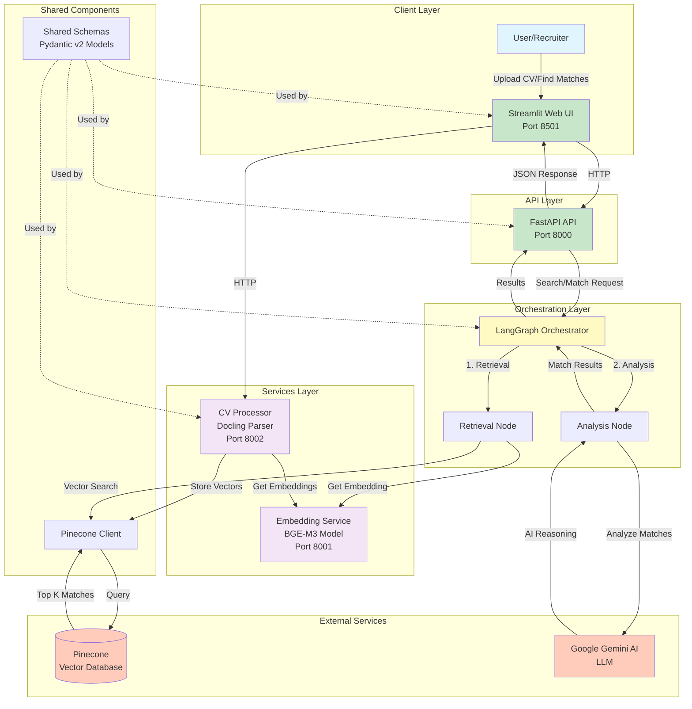

# Funds Search: Multi-Agent RAG Matching System

A production-ready system for matching candidates with job vacancies using LangGraph orchestration, semantic embeddings, and AI-powered reasoning.

## Overview

Funds Search uses a Multi-Agent RAG (Retrieval-Augmented Generation) architecture to:
- Process and index CV/resume documents
- Process and index vacancy descriptions
- Match candidates with vacancies using semantic similarity and AI reasoning
- Provide a user-friendly web interface for recruiters

## Architecture



## Components

### Apps (`apps/`)
- **api**: FastAPI REST API with LangGraph orchestrator (Port 8000)
- **web_ui**: Streamlit dashboard for CV upload and matching (Port 8501)
- **orchestrator**: LangGraph state machine for search and matching workflows

### Services (`services/`)
- **embedding-service**: BGE-M3 embedding model service (Port 8001)
- **cv-processor**: PDF/DOCX processing and vector storage (Port 8002 external, 8001 internal)
- **vc-worker**: Placeholder for future job scraping functionality (Port 8003)

### Shared (`shared/`)
- **schemas.py**: Pydantic v2 models (single source of truth for data structures)
- **pinecone_client.py**: Vector database client wrapper

## Tech Stack

- **Orchestration**: LangGraph/LangChain
- **LLM**: Google Gemini (for AI reasoning)
- **Embeddings**: BAAI/bge-m3 (1024-dimensional vectors)
- **Vector DB**: Pinecone (namespaces: "cvs", "vacancies")
- **API Framework**: FastAPI/Uvicorn
- **UI**: Streamlit
- **Document Processing**: Docling (PDF → Markdown)
- **Deployment**: Docker, Azure Container Apps, GitHub Actions

## Quick Start

### Prerequisites

- Docker and Docker Compose
- Environment variables (create `.env` file):
  ```bash
  PINECONE_API_KEY=your_key
  PINECONE_INDEX_NAME=funds-search
  GOOGLE_API_KEY=your_key
  ```

### Local Development

1. **Clone and setup**:
   ```bash
   git clone <repo-url>
   cd funds-search
   cp .env.example .env  # Create .env with your API keys
   ```

2. **Start all services**:
   ```bash
   docker-compose up --build
   ```

3. **Access the UI**:
   - Web UI: http://localhost:8501
   - API: http://localhost:8000
   - API Docs: http://localhost:8000/docs

## API Endpoints

### Main API (Port 8000)

- `GET /health` - Health check
- `POST /search` - Search for job openings
  ```json
  {
    "query": "software engineer",
    "location": "San Francisco",
    "role": "engineer",
    "remote": true,
    "user_id": "optional"
  }
  ```
- `POST /match` - Match candidate with vacancies
  ```json
  {
    "candidate_id": "user123",
    "top_k": 10
  }
  ```

### CV Processor (Port 8002)

- `POST /process-cv` - Upload and process CV (multipart/form-data with `user_id` and `file`)
- `POST /process-vacancy` - Process vacancy description (JSON with `vacancy_id` and `text`)

### Embedding Service (Port 8001)

- `POST /embed` - Generate embeddings for texts
  ```json
  {
    "texts": ["text to embed"]
  }
  ```

## Data Flow

### CV Processing Flow
1. User uploads PDF via Web UI
2. CV Processor converts PDF → Markdown (Docling, async via `run_in_threadpool`)
3. Text chunked (1000 chars, 800 overlap)
4. Embeddings generated via Embedding Service
5. Stored in Pinecone namespace "cvs"

### Matching Flow
1. User requests matches for candidate_id
2. API → Orchestrator → Retrieval Node
3. Fetch candidate embedding from Pinecone "cvs" namespace
4. Search vacancies in Pinecone "vacancies" namespace
5. Analysis Node uses Gemini to rerank and generate reasoning
6. Return ranked results with scores and AI explanations

## Deployment

### Azure Container Apps

Each component has a GitHub Actions workflow:
- `.github/workflows/deploy-api.yml` - API service (optimized <500MB image)
- `.github/workflows/deploy-web-ui.yml` - Web UI
- `.github/workflows/deploy-cv-processor.yml` - CV Processor
- `.github/workflows/deploy-embedding.yml` - Embedding Service

**Registry**: `fundssearchregistry.azurecr.io`

**Container Apps**:
- `api` (Port 8000)
- `web-ui` (Port 8501)
- `cv-processor` (Port 8001)
- `embedding-service` (Port 8001)

### Environment Variables

**API Service**:
- `PINECONE_API_KEY`
- `GOOGLE_API_KEY`
- `EMBEDDING_SERVICE_URL` (default: `http://embedding-service:8001`)

**Web UI**:
- `BACKEND_API_URL` (default: `http://api:8000`)
- `CV_PROCESSOR_URL` (default: `http://cv-processor:8001`)

**CV Processor**:
- `PINECONE_API_KEY`
- `PINECONE_INDEX_NAME`
- `EMBEDDING_SERVICE_URL`

## Project Structure

```
funds-search/
├── apps/
│   ├── api/              # FastAPI REST API
│   ├── orchestrator/     # LangGraph workflows
│   └── web_ui/           # Streamlit dashboard
├── services/
│   ├── cv-processor/     # CV processing service
│   ├── embedding-service/ # BGE-M3 embedding service
│   └── vc-worker/        # (Placeholder)
├── shared/
│   ├── schemas.py        # Pydantic v2 models (SSOT)
│   └── pinecone_client.py # Vector DB client
├── requirements/         # Dependency management
│   ├── base.txt         # Common dependencies
│   ├── ml.txt           # ML libraries (torch, transformers)
│   └── api.txt          # API dependencies (no ML)
├── docker-compose.yml
└── .github/workflows/   # CI/CD pipelines
```

## Documentation

- **[Services README](services/README.md)** - Microservices architecture
- **[Apps README](apps/README.md)** - Application components
- **[Shared README](shared/README.md)** - Shared modules and schemas

## Notes / Assumptions

- **Schemas**: All Pydantic v2 models are in `shared/schemas.py` (single source of truth)
- **Ports**: External ports differ from internal for cv-processor (8002 vs 8001)
- **CV Processing**: Uses `run_in_threadpool` for Docling to avoid blocking async event loop
- **Image Optimization**: API service uses multi-stage Docker build to reduce size from 4GB to <500MB
- **Namespaces**: Pinecone uses "cvs" for candidate resumes and "vacancies" for job postings
- **Web UI**: Requires `BACKEND_API_URL` and `CV_PROCESSOR_URL` environment variables

## License

See LICENSE file for details.
