# Funds Search — Conversational Multi‑Agent Job Matching

Funds Search is a microservice system that matches candidates to startup/VC roles using a **multi‑agent AI workflow**. Each agent has a clear responsibility: the **Talent Strategist** builds a user profile from chat/CV, the **Job Scout** runs vector search with filters, the **Matchmaker** scores and explains fit, and the **Validator** enforces hard constraints. Orchestration is done with **LangGraph**, retrieval uses **BGE‑M3 embeddings + Pinecone**, and every result includes an explanation.

---

## Goals

- **Conversational UI**: users describe intent naturally, optionally attach a CV.
- **Deterministic backend**: explicit state machine + schemas for traceability.
- **Explainable matching**: each result includes an AI‑generated explanation.
- **Scalable architecture**: services isolated for GPU/CPU scaling.

---

## Quick Start (Docker)

### 1) Create `.env` (minimal)
```bash
PINECONE_API_KEY=...
PINECONE_INDEX_NAME=funds-search

# LLM providers (configure what you actually use)
DEEPSEEK_API_KEY=...

# Optional (only if Matchmaker uses them)
OPENAI_API_KEY=...
ANTHROPIC_API_KEY=...

# Optional: needed only for Admin Scraper tool
FIRECRAWL_API_KEY=...
```

### 2) Run
```bash
docker compose up -d --build
```

### 3) Access
- Web UI (Streamlit): http://localhost:8501  
- API (FastAPI): http://localhost:8000  
- OpenAPI docs: http://localhost:8000/docs

---

## High‑Level Architecture

```mermaid
graph TD
    %% Colors and Styles
    classDef user fill:#f9f,stroke:#333,stroke-width:2px;
    classDef agent fill:#00c2ff,stroke:#005577,stroke-width:2px,color:#fff;
    classDef service fill:#77dd77,stroke:#225522,stroke-width:2px;
    classDef database fill:#ffb347,stroke:#774400,stroke-width:2px;
    classDef infrastructure fill:#e1e1e1,stroke:#666,stroke-width:2px,stroke-dasharray: 5 5;

    USER((👤 User)):::user -->|Chat / CV| UI[🖥️ Web UI: Streamlit]

    subgraph "☁️ Cloud Infrastructure (Docker / K8s)"
        subgraph "🛠️ Orchestration Layer (FastAPI Gateway)"
            UI <--> API[FastAPI Gateway]
            API --> ORCH{🧠 Orchestrator}
        end

        subgraph "🤖 AI Agent Fleet (LangGraph)"
            TS[<b>Talent Strategist</b><br/><i>Profile & Memory</i>]:::agent
            JS[<b>Job Scout</b><br/><i>Search Executor</i>]:::agent
            MM[<b>Matchmaker</b><br/><i>Analyst</i>]:::agent
            VLD[<b>Validator</b><br/><i>Hard Filters</i>]:::agent
            VA[<b>Vacancy Analyst</b><br/><i>Enrichment</i>]:::agent
        end

        subgraph "⚙️ Microservices"
            EMB[🧮 Embedding Service<br/>BGE-M3 Model]:::service
            CV[📄 CV Processor<br/>Docling PDF/DOCX Parser]:::service
        end
    end

    subgraph "💾 Persistence Layer (Managed)"
        PC[(🌲 Pinecone Vector DB<br/><i>Vacancies Namespace</i>)]:::database
        PC2[(🌲 Pinecone Vector DB<br/><i>CVs Namespace</i>)]:::database
    end

    ORCH -->|1. Analyze Chat/CV| TS
    TS -->|UserProfile| ORCH
    ORCH -->|2. Search Request| JS
    JS -->|search_vacancies_tool| ORCH

    ORCH -->|Embedding Query| EMB
    EMB -->|Vectors| PC

    CV -->|Embeddings| EMB
    CV -->|Chunks| PC2

    PC -->|Candidates| ORCH
    ORCH -->|4. Analysis| MM
    MM -->|Match Results| VLD
    VLD -->|Validated Results| UI
```



---

## Core Runtime Flow (LangGraph)


---

## Agent System (core behavior)

| Agent | Role | What it does in the current system |
|:------|:-----|:------------------------------------|
| **Talent Strategist** | Profile & memory | Builds/updates `UserProfile` from chat and CV. Only agent that asks questions. |
| **Job Scout** | Search executor | Builds the query from `UserProfile` (summary + top skills) and calls `search_vacancies_tool` directly. |
| **Matchmaker** | Scoring & explanation | LLM scores each vacancy (0–10) and explains why it fits. |
| **Validator** | Hard‑filter audit | Checks location/salary constraints and can request re‑search. |
| **Vacancy Analyst** | Ingestion enrichment | Offline agent used during ingestion to classify and extract structured signals before indexing. |

---

## Parsing & Enrichment Pipeline (ingestion)

Before vacancies are indexed, the **Vacancy Analyst** extracts structured signals to improve search precision.

**1. Classification (taxonomy)**
- Category mapping (e.g., Engineering, Product)
- Seniority inference (Junior → Lead)
- Remote policy (Remote / Hybrid / On‑site)

**2. Deep extraction**
- Tech stack, required skills, nice‑to‑haves
- Domain tags (Fintech, AI, etc.)
- Culture/benefits/constraints (salary, visa, timezone)

**3. Storage**
- Structured metadata stored alongside embeddings in Pinecone
- Enables hybrid search: semantic + hard filters

---

## Services & Responsibilities

### Apps
- `apps/api/` — FastAPI gateway (chat/search endpoints, SSE `/chat/stream`)
- `apps/orchestrator/` — LangGraph workflow + agents
- `apps/web_ui/` — Streamlit UI

### Services
- `services/embedding-service/` — BGE‑M3 embeddings (HTTP service)
- `services/cv-processor/` — CV parsing + embedding ingestion

### Shared
- `shared/` — shared schemas + Pinecone client

---

## Project Navigation (READMEs)

Key docs are intentionally distributed:

- Orchestrator flow + state: `apps/orchestrator/README.md`
- API endpoints + streaming: `apps/api/README.md`
- UI behavior + tabs: `apps/web_ui/README.md`
- Embedding service: `services/embedding-service/README.md`
- CV processor: `services/cv-processor/README.md`
- Shared schemas: `shared/README.md`

---

## Docs (Deep Dives)
- `docs/architecture.md`
- `docs/api.md`
- `docs/deployment.md`
- `docs/schemas.md`
- `docs/troubleshooting.md`
