# Funds Search — Conversational Multi-Agent Job Matching

A microservice system that helps a candidate find and explain best-fit roles (VC / startup jobs) using:
- **LangGraph** orchestration
- **BGE-M3 embeddings**
- **Pinecone** vector search
- A small **agent fleet** (profiling → intent → matching → live scraping fallback)

> Repo goal: keep the UI conversational and the backend deterministic/traceable (schemas + clear agent boundaries).

---

## Quick Start (Docker)

### 1) Create `.env` (minimal)
```bash
PINECONE_API_KEY=...
PINECONE_INDEX_NAME=funds-search

# LLM providers (configure what you actually use)
DEEPSEEK_API_KEY=...

# Optional (only if Matchmaker uses them)
OPENAI_API_KEY=...
ANTHROPIC_API_KEY=...

# Optional: real-time job crawling
FIRECRAWL_API_KEY=...
```

### 2) Run
```bash
docker compose up -d --build
```

### 3) Access
- Web UI (Streamlit): http://localhost:8501  
- API (FastAPI): http://localhost:8000  
- OpenAPI docs: http://localhost:8000/docs

---

## System Design: Conversational AI Agent Architecture

```mermaid
graph TD
    %% Colors and Styles
    classDef user fill:#f9f,stroke:#333,stroke-width:2px;
    classDef agent fill:#00c2ff,stroke:#005577,stroke-width:2px,color:#fff;
    classDef service fill:#77dd77,stroke:#225522,stroke-width:2px;
    classDef database fill:#ffb347,stroke:#774400,stroke-width:2px;

    %% Client Side
    USER((👤 User)):::user -->|Chat / CV| UI[🖥️ Web UI: Streamlit]

    subgraph "🛠️ Orchestration Layer (FastAPI Gateway)"
        UI <--> HUB{🧠 Agent Dispatcher}
    end

    %% Specialized Agents
    subgraph "🤖 AI Agent Fleet"
        TS[<b>Talent Strategist</b><br/><i>The Profiler</i><br/>DeepSeek V3]:::agent
        JS[<b>Job Scout</b><br/><i>The Intent Extractor</i><br/>DeepSeek R1]:::agent
        MM[<b>Matchmaker</b><br/><i>The Analytical RAG</i><br/>Claude/GPT-4o]:::agent
        HA[<b>Hunter Agent</b><br/><i>Real-time Scraper</i><br/>Firecrawl Service]:::agent
    end

    %% Internal Services
    subgraph "⚙️ Infrastructure Services"
        EMB[🧮 Embedding Service<br/>BGE-M3 Model]:::service
        CV[📄 CV Processor<br/>PDF OCR / Parser]:::service
    end

    %% Data Storage
    subgraph "💾 Persistence Layer"
        PC[(🌲 Pinecone Vector DB<br/><i>Vacancies Namespace</i>)]:::database
        PC2[(🌲 Pinecone Vector DB<br/><i>Personas Namespace</i>)]:::database
    end

    %% Connections
    HUB -->|1. Parse CV| TS
    TS -->|Text Extraction| CV
    TS -->|Save Digital Twin| PC2

    HUB -->|2. Understand Message| JS
    JS -->|Vectorize Intent| EMB
    EMB -->|Semantic Search| PC

    HUB -->|3. Compare & Filter| MM
    MM <-->|Fetch Top K| PC
    MM <-->|Get User Profile| PC2

    HUB -->|4. No Data?| HA
    HA -->|Live Crawl| a16z_Jobs[🌐 a16z Boards]

    %% Feedback loop
    MM -->|Final Response| UI
```



---

## 📋 Agent Roles (The Agentic Fleet)

We avoid a single "all-knowing bot". Each role is specialized, cheaper to run, and easier to debug.

| Agent | Role | Model (Provider) | What it does |
|------:|------|------------------|--------------|
| **Talent Strategist 🕵️‍♂️** | Profiler | **DeepSeek V3** (cheap/fast) | Parses CV / interview answers → extracts skills & preferences → produces a **UserPersona JSON** |
| **Job Scout 🛰️** | Intent Extractor | **DeepSeek R1** (reasoning) | Converts vague user intent ("like Google but in crypto") → **structured filters + vector query** |
| **Matchmaker 🤝** | RAG Logic | **GPT-4o / Claude 3.5** | Takes top-K results → compares vs persona → explains why it's a strong match (score + reasoning) |
| **Hunter Agent 🏹** | Real-time Scraper | **Firecrawl / APIs** | Wakes up if cache/DB is empty → fetches fresh jobs → returns items for indexing |

### CV Missing State

The system gracefully handles cases where a user hasn't uploaded their CV:

- **Broad Search Mode**: When `persona` is missing, the system performs a general search without personalized matching
- **Response Flags**: All vacancies include `persona_applied: false` and `match_score: 0`
- **User Guidance**: Each vacancy displays: `"CV missing: Upload your resume in the 'Career & Match Hub' to enable AI matching."`
- **Logging**: The system logs a `chat_search_without_persona` warning event when persona data is absent
- **UI Feedback**: The web UI displays a warning banner and "Resume Required" badges when CV is missing

> Provider choice is configuration. The docs describe intent; your `.env` decides which providers are enabled.

---

## Repo Map (high level)

- `apps/api/` — FastAPI gateway (chat/search endpoints, diagnostics)
- `apps/orchestrator/` — LangGraph orchestration (agent flow + state)
- `apps/web-ui/` — Streamlit UI (chat + system diagnostics)
- `services/embedding-service/` — BGE-M3 embeddings (HTTP service)
- `services/cv-processor/` — PDF parsing + text extraction (HTTP service)
- `shared/` — shared schemas, clients, Pinecone helpers

---

## Docs (Deep Dives)

- Architecture: `docs/architecture.md`
- API reference: `docs/api.md`
- Deployment: `docs/deployment.md`
- Schemas: `docs/schemas.md`
- Troubleshooting: `docs/troubleshooting.md`
