# Autonomous Job Hunter: Multi-Agent RAG Matching System


[](https://github.com/kkonst-bond-edu/funds-search/actions/workflows/deploy-embedding.yml)


**Version: 2.0.0 (MVP)**

Production-ready autonomous job discovery and matching system using LangGraph orchestration, semantic embeddings (BGE-M3), and AI reasoning (Gemini).

## Project Overview & Goal

**Goal**: Autonomous job discovery and matching system that helps candidates find their ideal roles at VC-backed startups through intelligent agentic workflows.

**Evolution**: This project is evolving from "Funds Search" into "Autonomous Job Hunter" with a 3-agent architecture:
- **Talent Strategist**: Builds personalized candidate profiles through conversational interviews
- **Web Hunter**: Discovers job opportunities using Firecrawl web scraping
- **Deep Match Analyst**: Performs sophisticated matching analysis with structured reports

**Architecture**: Multi-Agent RAG (Retrieval-Augmented Generation) system with 3-agent workflow:
- **Talent Strategist Agent**: Conducts conversational interviews to build UserPersona profiles (technical skills, career goals, startup stage preferences, cultural fit)
- **Web Hunter Agent**: Discovers job opportunities from VC fund websites using Firecrawl integration
- **Deep Match Analyst Agent**: Performs sophisticated matching analysis, generating structured MatchingReport objects with strengths, weaknesses, value propositions, and suggested actions
- Processes and indexes CV/resume documents in Pinecone namespace `"cvs"`
- Processes and indexes vacancy descriptions in Pinecone namespace `"vacancies"`
- Matches candidates with vacancies using semantic similarity (BGE-M3 embeddings)
- Generates AI explanations (Gemini) explaining why each vacancy fits the candidate
- Provides a user-friendly web interface with AI Talent Strategist chat interface

**Current Working State**: 
- ✅ CV processing and storage in namespace `"cvs"` with metadata `type: 'cv'`
- ✅ Vacancy processing and storage in namespace `"vacancies"` with metadata `type: 'vacancy'`
- ✅ Candidate-vacancy matching with AI reasoning using Gemini 2.5 Flash
- ✅ LangGraph orchestrator with enhanced workflow (talent_strategist → web_hunter → fetch_candidate → search_vacancies → rerank_and_explain)
- ✅ UserPersona and MatchingReport schemas for structured agentic workflows
- ✅ Placeholder nodes for Talent Strategist and Web Hunter agents
- ✅ UI framework with AI Talent Strategist chat interface placeholder

**Phase 1 Complete**:
- ✅ Firecrawl integration for real vacancy search
- ✅ Vacancy Search API with mock and Firecrawl modes
- ✅ Robust CompanyStage enum comparison
- ✅ Streamlit UI with Vacancy Search tab
- ✅ Security: API key masking in logs

**Upcoming Roadmap**:
- 🔄 Full Talent Strategist interview processing logic
- 🔄 Deep Match Analysis with structured MatchingReport generation

## System Architecture


## System Design: Conversational AI Agent Architecture

```mermaid
graph TD
    %% Colors and Styles
    classDef user fill:#f9f,stroke:#333,stroke-width:2px;
    classDef agent fill:#00c2ff,stroke:#005577,stroke-width:2px,color:#fff;
    classDef service fill:#77dd77,stroke:#225522,stroke-width:2px;
    classDef database fill:#ffb347,stroke:#774400,stroke-width:2px;

    %% Client Side
    USER((👤 User)):::user -->|Chat / CV| UI[🖥️ Web UI: Streamlit]

    subgraph "🛠️ Orchestration Layer (FastAPI Gateway)"
        UI <--> HUB{🧠 Agent Dispatcher}
    end

    %% Specialized Agents
    subgraph "🤖 AI Agent Fleet"
        TS[<b>Talent Strategist</b><br/><i>The Profiler</i><br/>DeepSeek V3]:::agent
        JS[<b>Job Scout</b><br/><i>The Intent Extractor</i><br/>DeepSeek R1]:::agent
        MM[<b>Matchmaker</b><br/><i>The Analytical RAG</i><br/>Claude/GPT-4o]:::agent
        HA[<b>Hunter Agent</b><br/><i>Real-time Scraper</i><br/>Firecrawl Service]:::agent
    end

    %% Internal Services
    subgraph "⚙️ Infrastructure Services"
        EMB[🧮 Embedding Service<br/>BGE-M3 Model]:::service
        CV[📄 CV Processor<br/>PDF OCR / Parser]:::service
    end

    %% Data Storage
    subgraph "💾 Persistence Layer"
        PC[(🌲 Pinecone Vector DB<br/><i>Vacancies Namespace</i>)]:::database
        PC2[(🌲 Pinecone Vector DB<br/><i>Personas Namespace</i>)]:::database
    end

    %% Connections
    HUB -->|1. Parse CV| TS
    TS -->|Text Extraction| CV
    TS -->|Save Digital Twin| PC2

    HUB -->|2. Understand Message| JS
    JS -->|Vectorize Intent| EMB
    EMB -->|Semantic Search| PC

    HUB -->|3. Compare & Filter| MM
    MM <-->|Fetch Top K| PC
    MM <-->|Get User Profile| PC2

    HUB -->|4. No Data?| HA
    HA -->|Live Crawl| a16z_Jobs[🌐 a16z Boards]

    %% Feedback loop
    MM -->|Final Response| UI
```



## Component Descriptions

### Apps (`apps/`)

| Component | Port | Description |
|-----------|------|-------------|
| **api** | 8000 | FastAPI REST API + LangGraph orchestrator. Multi-stage Docker build (<500MB image). |
| **web_ui** | 8501 | Streamlit dashboard for CV upload and match viewing. Requires `BACKEND_API_URL` and `CV_PROCESSOR_URL` env vars. |
| **orchestrator** | - | LangGraph state machines for search and matching workflows. Two graphs: search workflow and matching workflow. |

### Services (`services/`)

| Component | Port | Description |
|-----------|------|-------------|
| **embedding-service** | 8001 | BGE-M3 embedding model service (1024-dim vectors). Requires 2-4GB RAM. |
| **cv-processor** | 8002 | PDF→Markdown (Docling), chunking, vectorization. Uses `run_in_threadpool` for async. Processes CVs and vacancies. |
| **vc-worker** | 8003 | Placeholder for future job scraping functionality. |

**Architecture Rule**: Services must **not** import from `apps/`. They may only import from `shared/` (schemas, pinecone_client).

### Shared (`shared/`)

- **schemas.py**: Pydantic v2 models (single source of truth) - Job, Resume, Vacancy, MatchResult, VacancyMatchResult, etc.
- **pinecone_client.py**: Pinecone client wrapper with namespace management (`"cvs"` for candidates, `"vacancies"` for job postings)

## Data Schemas

All schemas in `shared/schemas.py` (Pydantic v2, single source of truth):

### Core Models

**`DocumentChunk`** - Semantic text chunks with embeddings
```python
{
  "text": str,              # Chunk content
  "metadata": Dict,         # Additional metadata (type: 'cv' | 'vacancy')
  "embedding": List[float]  # 1024-dim BGE-M3 vector
}
```

**`Resume`** - Candidate CV/resume
```python
{
  "id": str,                    # Unique resume ID
  "user_id": str,               # Candidate identifier
  "raw_text": str,              # Full CV text
  "chunks": List[DocumentChunk], # Processed chunks (type: 'cv')
  "processed_at": datetime,
  "created_at": datetime
}
```

**`Vacancy`** - Job posting
```python
{
  "id": str,                    # Unique vacancy ID
  "raw_text": str,              # Full job description
  "chunks": List[DocumentChunk], # Processed chunks (type: 'vacancy')
  "processed_at": datetime,
  "created_at": datetime
}
```

**`Job`** - Job opening (search results)
```python
{
  "id": str,
  "company": str,
  "title": str | None,
  "raw_text": str,
  "vector": List[float] | None,
  "url": str | None,
  "source_url": str | None,  # Original source URL where job was discovered
  "location": str | None,
  "remote": bool | None,
  "vc_fund": str | None,  # VC fund or investor associated with the company
  "created_at": datetime
}
```

### Request/Response Models

**`SearchRequest`** - Job search query
```python
{
  "query": str,              # Required: search text
  "location": str | None,    # Optional filter
  "role": str | None,        # Optional job title filter
  "remote": bool | None,     # Optional remote filter
  "user_id": str | None      # Optional personalization
}
```

**`MatchRequest`** - Candidate-vacancy matching
```python
{
  "candidate_id": str,       # Required: user_id
  "top_k": int = 10          # Number of matches
}
```

**`MatchResult`** - Search/match result
```python
{
  "score": float,            # Cosine similarity (0-1)
  "reasoning": str,          # AI-generated explanation
  "job": Job,                # Matched job posting
  "resume": Resume | None    # Candidate resume (if applicable)
}
```

**`VacancyMatchResult`** - Candidate-vacancy match
```python
{
  "score": float,            # Similarity score
  "reasoning": str,          # Why vacancy fits candidate
  "vacancy_id": str,
  "vacancy_text": str,
  "candidate_id": str
}
```

**`UserPersona`** - Candidate profile from Talent Strategist interview
```python
{
  "technical_skills": List[str],
  "career_goals": List[str],
  "preferred_startup_stage": str | None,  # Seed, Series A, Series B, etc.
  "cultural_preferences": List[str],
  "user_id": str | None
}
```

**`MatchingReport`** - Structured matching analysis (replaces simple reasoning)
```python
{
  "match_score": int,        # 0-100 match score
  "strengths": List[str],    # Positive matches
  "weaknesses": List[str],   # Gaps or concerns
  "value_proposition": str,   # Why this match is valuable
  "suggested_action": str,    # Recommended next steps
  "job_id": str | None,
  "vacancy_id": str | None,
  "candidate_id": str | None
}
```

## Setup & Environment Variables

### Prerequisites
- Docker & Docker Compose
- `.env` file with required API keys

### Environment Variables

**Root `.env` file:**
```bash
PINECONE_API_KEY=your_key
PINECONE_INDEX_NAME=funds-search
GOOGLE_API_KEY=your_key
FIRECRAWL_API_KEY=your_key  # Optional: For real vacancy search via Firecrawl
```

**Service-Specific Variables:**

| Service | Required Variables |
|---------|-------------------|
| **API** | `PINECONE_API_KEY`, `GOOGLE_API_KEY`, `FIRECRAWL_API_KEY` (optional), `EMBEDDING_SERVICE_URL` (default: `http://embedding-service:8001`) |
| **Web UI** | `BACKEND_API_URL` (default: `http://api:8000`), `CV_PROCESSOR_URL` (default: `http://cv-processor:8001`), `FIRECRAWL_API_KEY` (optional) |
| **CV Processor** | `PINECONE_API_KEY`, `PINECONE_INDEX_NAME`, `EMBEDDING_SERVICE_URL` |
| **Embedding** | `CUDA_VISIBLE_DEVICES` (optional, for GPU) |

### Firecrawl Setup (Optional)

To enable real vacancy search via Firecrawl:

1. **Get Firecrawl API Key:**
   - Sign up at https://firecrawl.dev
   - Get your API key from the dashboard

2. **Add to `.env`:**
   ```bash
   FIRECRAWL_API_KEY=fc-your_api_key_here
   ```

3. **Verify Configuration:**
   ```bash
   curl http://localhost:8000/api/v1/vacancies/health
   ```
   Check that `firecrawl_configured: true` in the response.

**Note:** Without `FIRECRAWL_API_KEY`, the system will use mock data for vacancy search.

### Quick Start

```bash
git clone <repo-url>
cd funds-search
cp .env.example .env  # Add your API keys (including FIRECRAWL_API_KEY if desired)
docker-compose up --build
```

**Access:**
- 🌐 Web UI: http://localhost:8501 (includes AI Talent Strategist chat interface)
- 🔌 API: http://localhost:8000
- 📚 API Docs: http://localhost:8000/docs

## API & UI Usage Guide

### Main API (`:8000`)

| Endpoint | Method | Description |
|----------|--------|-------------|
| `/health` | GET | Health check |
| `/api/v1/system/diagnostics` | GET | System diagnostics (checks all services) |
| `/api/v1/vacancies/search` | POST | Search vacancies (returns `List[Vacancy]`) - supports mock and Firecrawl modes |
| `/api/v1/vacancies/health` | GET | Vacancy search service health (includes Firecrawl configuration status) |
| `/search` | POST | Search jobs (returns `List[MatchResult]`) |
| `/match` | POST | Match candidate→vacancies (returns `List[VacancyMatchResult]`) |

**`POST /search`** - Job search with filters
```json
{
  "query": "software engineer",
  "location": "San Francisco",
  "role": "engineer",
  "remote": true,
  "user_id": "optional"
}
```

**`POST /match`** - Candidate-vacancy matching
```json
{
  "candidate_id": "user123",
  "top_k": 10
}
```

**`GET /api/v1/system/diagnostics`** - System diagnostics (v2.0.0)
```bash
curl http://localhost:8000/api/v1/system/diagnostics
```

Returns comprehensive health check for all services:
- CV Processor
- Embedding Service
- Pinecone Vector Store
- LLM Provider (Google Gemini)

**Response Example:**
```json
{
  "status": "ok",
  "services": {
    "cv_processor": {
      "status": "ok",
      "latency": 45.2,
      "error": null,
      "error_type": null
    },
    "embedding_service": {
      "status": "ok",
      "latency": 12.5,
      "error": null,
      "error_type": null
    },
    "pinecone": {
      "status": "ok",
      "latency": 234.1,
      "error": null,
      "error_type": null
    },
    "llm_provider": {
      "status": "ok",
      "latency": 567.8,
      "error": null,
      "error_type": null
    }
  },
  "timestamp": "2024-12-XXT..."
}
```

**Match Response Example:**
```json
[
  {
    "score": 0.85,
    "reasoning": "This vacancy is a great fit because the candidate has 5+ years of Python experience matching the job requirements...",
    "vacancy_id": "vacancy_1",
    "vacancy_text": "We are looking for a Python developer...",
    "candidate_id": "user123"
  }
]
```

### Vacancy API (`:8000`)

The Vacancy Search Service provides endpoints for searching and filtering job vacancies.

| Endpoint | Method | Description |
|----------|--------|-------------|
| `/api/v1/vacancies/search` | POST | Search vacancies with filters (returns `List[Vacancy]`) |
| `/api/v1/vacancies/health` | GET | Health check for vacancy search service |

**`POST /api/v1/vacancies/search`** - Search vacancies with filters

Accepts a `VacancyFilter` object and returns a list of matching `Vacancy` objects. Currently implements mock logic returning 2-3 realistic vacancies from logistics/AI startups for UI testing.

**Request Body:**
```json
{
  "role": "Software Engineer",
  "skills": ["Python", "FastAPI", "PostgreSQL"],
  "location": "San Francisco",
  "is_remote": true,
  "company_stages": ["Seed", "SeriesA"],
  "industry": "Logistics",
  "min_salary": 120000
}
```

**Request Schema (`VacancyFilter`):**
- `role` (optional, string): Job role or title filter
- `skills` (optional, List[str]): Required skills list
- `location` (optional, string): Job location filter
- `is_remote` (optional, bool): Remote work option filter
- `company_stages` (optional, List[Enum]): Company funding stages filter (Seed, SeriesA, Growth, ScaleUp)
- `industry` (optional, string): Industry filter
- `min_salary` (optional, int): Minimum salary requirement (>= 0)

**Response Schema (`Vacancy`):**
- `title` (string): Job title
- `company_name` (string): Company name
- `company_stage` (Enum): Company funding stage (Seed, SeriesA, Growth, ScaleUp)
- `location` (string): Job location
- `industry` (string): Industry sector
- `salary_range` (optional, string): Salary range (e.g., "$120k-$180k")
- `description_url` (string): URL to full job description
- `required_skills` (List[str]): Required skills list
- `remote_option` (bool): Whether remote work is available

**Response Example:**
```json
[
  {
    "title": "Senior Backend Engineer",
    "company_name": "LogiTech AI",
    "company_stage": "SeriesA",
    "location": "San Francisco, CA",
    "industry": "Logistics",
    "salary_range": "$150k-$200k",
    "description_url": "https://logitech-ai.com/careers/backend-engineer",
    "required_skills": ["Python", "FastAPI", "PostgreSQL", "Docker", "AWS"],
    "remote_option": true
  },
  {
    "title": "ML Engineer - Supply Chain Optimization",
    "company_name": "RouteOptima",
    "company_stage": "Seed",
    "location": "New York, NY",
    "industry": "Logistics",
    "salary_range": "$130k-$170k",
    "description_url": "https://routeoptima.com/jobs/ml-engineer",
    "required_skills": ["Python", "TensorFlow", "PyTorch", "Kubernetes", "GCP"],
    "remote_option": false
  }
]
```

**Example Request:**
```bash
curl -X POST "http://localhost:8000/api/v1/vacancies/search" \
  -H "Content-Type: application/json" \
  -d '{
    "role": "Engineer",
    "skills": ["Python", "FastAPI"],
    "location": "San Francisco",
    "is_remote": true,
    "company_stages": ["Seed", "SeriesA"],
    "industry": "Logistics",
    "min_salary": 120000
  }'
```

**`GET /api/v1/vacancies/health`** - Health check

Returns the health status of the vacancy search service.

**Response Example:**
```json
{
  "status": "ok",
  "service": "vacancy-search",
  "version": "1.0.0"
}
```

### CV Processor (`:8002`)

- **`POST /process-cv`** - Upload CV (multipart: `user_id`, `file`)
  ```bash
  curl -X POST "http://localhost:8002/process-cv?user_id=user123" \
    -F "file=@resume.pdf"
  ```

- **`POST /process-vacancy`** - Process vacancy (JSON: `vacancy_id`, `text`)
  ```bash
  curl -X POST http://localhost:8002/process-vacancy \
    -H "Content-Type: application/json" \
    -d '{"vacancy_id": "vac1", "text": "We are looking for..."}'
  ```

### Embedding Service (`:8001`)

- **`POST /embed`** - Generate embeddings
```json
{
  "texts": ["text to embed"]
}
```

### Testing Steps

1. **Start all services:**
   ```bash
   docker-compose up --build
   ```

2. **Upload a CV via Web UI:**
   - Navigate to http://localhost:8501
   - Upload a PDF resume
   - Enter user_id
   - Verify CV is processed

3. **Process a vacancy:**
   ```bash
   curl -X POST http://localhost:8002/process-vacancy \
     -H "Content-Type: application/json" \
     -d '{
       "vacancy_id": "vac1",
       "text": "We are looking for a Python developer with 5+ years of experience in backend development..."
     }'
   ```

4. **Match candidate with vacancies:**
   ```bash
   curl -X POST http://localhost:8000/match \
     -H "Content-Type: application/json" \
     -d '{"candidate_id": "user123", "top_k": 5}'
   ```

5. **Verify results:**
   - Check response contains `VacancyMatchResult` objects
   - Verify scores are between 0-1
   - Verify reasoning text is generated by Gemini

## Data Flow

### CV Processing Pipeline


### Vacancy Processing Pipeline


### Matching Pipeline (LangGraph Workflow)


## Orchestration Workflows

### Search Workflow (LangGraph)
1. **Retrieval Node**: Embed query → Search Pinecone → Get top 10 jobs
2. **Analysis Node**: Gemini analyzes each match → Generate reasoning → Return ranked results

### Matching Workflow (LangGraph)
**Graph Structure**: `Entry → talent_strategist → web_hunter → fetch_candidate → search_vacancies → rerank_and_explain → End`

**State Schema (`MatchingState`):**
- `candidate_id`: Input candidate identifier
- `candidate_embedding`: Retrieved embedding vector (average of CV chunks)
- `user_persona`: UserPersona object built from Talent Strategist interview
- `raw_scraped_data`: List of raw job data discovered by Web Hunter agent
- `retrieved_vacancies`: List of vacancy search results
- `vacancy_scores`: Similarity scores from Pinecone
- `match_results`: Final list of `VacancyMatchResult` objects (legacy format)
- `final_reports`: List of `MatchingReport` objects (new structured format)
- `top_k`: Number of results to return

**Nodes:**
1. **`talent_strategist_node`** (Placeholder): Processes interview/conversation context to build UserPersona. Extracts technical skills, career goals, startup stage preferences, and cultural fit.
2. **`web_hunter_node`** (Placeholder): Uses Firecrawl to discover job postings from VC fund websites. Scrapes and processes job listings, storing raw_scraped_data for further processing.
3. **`fetch_candidate_node`**: Fetches candidate embedding from Pinecone namespace `"cvs"`. Computes average of all CV chunks and normalizes. Raises error if candidate not found.
4. **`search_vacancies_node`**: Uses candidate embedding to search Pinecone namespace `"vacancies"` with filter `type: 'vacancy'`. Retrieves top-k results with similarity scores.
5. **`rerank_and_explain_node`**: For each vacancy, uses Gemini AI to:
   - Analyze why the vacancy fits the candidate
   - Generate detailed reasoning
   - Explain skills alignment and career benefits
   - Creates `VacancyMatchResult` objects with scores and reasoning
   - (Future: Generate `MatchingReport` objects with structured analysis)

**AI Prompting**: Uses `langchain-google-genai` (Gemini 2.5 Flash) with system prompt focused on recruiter-style analysis explaining skills match, experience alignment, career growth, and potential gaps.

## Key Implementation Details

| Aspect | Implementation |
|--------|----------------|
| **Schemas** | Single source of truth: `shared/schemas.py` (Pydantic v2) |
| **Ports** | CV Processor: 8002 (external) → 8001 (internal) |
| **CV Processing** | `run_in_threadpool` for Docling (non-blocking async) |
| **Image Size** | API: multi-stage build (4GB → <500MB) |
| **Pinecone** | Namespaces: `"cvs"` (resumes), `"vacancies"` (jobs)<br/>Metadata filter: `type: 'cv'` or `type: 'vacancy'` |
| **Chunking** | 1000 chars, 800 overlap |
| **Embeddings** | BGE-M3 (1024 dimensions), L2-normalized |
| **LLM** | Gemini 2.5 Flash (reasoning & reranking) |
| **Candidate Embedding** | Average of all CV chunks, normalized |
| **Vector Search** | Cosine similarity with metadata filters |

## Tech Stack

- **Orchestration**: LangGraph state machines (search & matching workflows)
- **LLM**: Google Gemini 2.5 Flash (reasoning)
- **Embeddings**: BAAI/bge-m3 (1024-dim)
- **Vector DB**: Pinecone (namespaces: `cvs`, `vacancies`; metadata filter: `type`)
- **API**: FastAPI/Uvicorn
- **UI**: Streamlit
- **Document Parser**: Docling (PDF→Markdown, async via `run_in_threadpool`)
- **Deployment**: Docker, Azure Container Apps, GitHub Actions

## Deployment

### Azure Container Apps

**Registry**: `fundssearchregistry.azurecr.io`

| Service | Container App | Port | Workflow |
|---------|---------------|------|----------|
| API | `api` | 8000 | `deploy-api.yml` (<500MB image) |
| Web UI | `web-ui` | 8501 | `deploy-web-ui.yml` |
| CV Processor | `cv-processor` | 8001 | `deploy-cv-processor.yml` |
| Embedding | `embedding-service` | 8001 | `deploy-embedding.yml` |

### CI/CD

GitHub Actions workflows (`.github/workflows/`):
- **`ci.yml`**: Runs `pytest apps/` (includes matching tests), validates with flake8, builds Docker images
- **`deploy-*.yml`**: Individual deployment workflows for each service

**Optimizations:**
- API service uses multi-stage Docker build to reduce image size from 4GB to <500MB
- Embedding service pre-downloads model during build
- All services use dependency caching

## Project Structure

```
funds-search/
├── apps/
│   ├── api/              # FastAPI REST API + LangGraph
│   ├── orchestrator/     # LangGraph state machines
│   └── web_ui/           # Streamlit dashboard
├── services/
│   ├── cv-processor/     # PDF→Markdown, chunking, vectorization
│   ├── embedding-service/ # BGE-M3 model service
│   └── vc-worker/        # (Placeholder)
├── shared/
│   ├── schemas.py        # Pydantic v2 models (SSOT)
│   └── pinecone_client.py # Vector DB wrapper
├── requirements/         # Dependency management
│   ├── base.txt       # Common deps
│   ├── ml.txt         # ML (torch, transformers)
│   └── api.txt        # API (no ML)
└── .github/workflows/ # CI/CD (Azure deployments)
```

## Documentation

- **[Services README](services/README.md)** - Microservices architecture
- **[Apps README](apps/README.md)** - Application components
- **[Shared README](shared/README.md)** - Shared modules
