# Funds Search: Multi-Agent RAG Matching System

Production-ready candidate-vacancy matching system using LangGraph orchestration, semantic embeddings (BGE-M3), and AI reasoning (Gemini).

## Overview

Multi-Agent RAG architecture that processes CVs/vacancies, generates embeddings, stores vectors in Pinecone, and matches candidates using semantic similarity + AI analysis.

## System Architecture

```mermaid
graph TB
    subgraph "Client"
        User[👤 Recruiter] --> WebUI[📊 Streamlit UI<br/>:8501]
    end
    
    subgraph "API Gateway"
        WebUI --> API[🚀 FastAPI<br/>:8000]
        WebUI -->|Upload CV| CVProc[📄 CV Processor<br/>:8002]
    end
    
    subgraph "Orchestration"
        API -->|Search/Match| Orch[🔄 LangGraph<br/>Orchestrator]
        Orch -->|1. Retrieve| RetNode[🔠Retrieval Node]
        Orch -->|2. Analyze| AnaNode[🤖 Analysis Node]
    end
    
    subgraph "Services"
        RetNode -->|Embed Query| EmbSvc[🧮 Embedding Service<br/>BGE-M3 :8001]
        RetNode -->|Vector Search| PC[(📦 Pinecone<br/>Vector DB)]
        CVProc -->|Get Embeddings| EmbSvc
        CVProc -->|Store Vectors| PC
    end
    
    subgraph "AI"
        AnaNode -->|Reasoning| Gemini[🧠 Gemini 2.5 Flash<br/>LLM]
    end
    
    subgraph "Data Models"
        Schemas[📋 Pydantic Schemas<br/>shared/schemas.py]
        Schemas -.->|Used by| API
        Schemas -.->|Used by| Orch
        Schemas -.->|Used by| CVProc
    end
    
    style User fill:#e1f5ff
    style WebUI fill:#c8e6c9
    style API fill:#c8e6c9
    style Orch fill:#fff9c4
    style EmbSvc fill:#f3e5f5
    style CVProc fill:#f3e5f5
    style PC fill:#ffccbc
    style Gemini fill:#ffccbc
    style Schemas fill:#e8f5e9
```



## Data Schemas

All schemas defined in `shared/schemas.py` (Pydantic v2, single source of truth):

### Core Models

**`DocumentChunk`** - Semantic text chunks with embeddings
```python
{
  "text": str,              # Chunk content
  "metadata": Dict,         # Additional metadata
  "embedding": List[float]  # 1024-dim BGE-M3 vector
}
```

**`Resume`** - Candidate CV/resume
```python
{
  "id": str,                    # Unique resume ID
  "user_id": str,               # Candidate identifier
  "raw_text": str,              # Full CV text
  "chunks": List[DocumentChunk], # Processed chunks
  "processed_at": datetime,
  "created_at": datetime
}
```

**`Vacancy`** - Job posting
```python
{
  "id": str,                    # Unique vacancy ID
  "raw_text": str,              # Full job description
  "chunks": List[DocumentChunk], # Processed chunks
  "processed_at": datetime,
  "created_at": datetime
}
```

**`Job`** - Job opening (search results)
```python
{
  "id": str,
  "company": str,
  "title": str | None,
  "raw_text": str,
  "vector": List[float] | None,
  "url": str | None,
  "location": str | None,
  "remote": bool | None,
  "created_at": datetime
}
```

### Request/Response Models

**`SearchRequest`** - Job search query
```python
{
  "query": str,              # Required: search text
  "location": str | None,    # Optional filter
  "role": str | None,        # Optional job title filter
  "remote": bool | None,     # Optional remote filter
  "user_id": str | None      # Optional personalization
}
```

**`MatchRequest`** - Candidate-vacancy matching
```python
{
  "candidate_id": str,       # Required: user_id
  "top_k": int = 10          # Number of matches
}
```

**`MatchResult`** - Search/match result
```python
{
  "score": float,            # Cosine similarity (0-1)
  "reasoning": str,          # AI-generated explanation
  "job": Job,                # Matched job posting
  "resume": Resume | None    # Candidate resume (if applicable)
}
```

**`VacancyMatchResult`** - Candidate-vacancy match
```python
{
  "score": float,            # Similarity score
  "reasoning": str,          # Why vacancy fits candidate
  "vacancy_id": str,
  "vacancy_text": str,
  "candidate_id": str
}
```

## Components

| Component | Port | Description |
|-----------|------|-------------|
| **web-ui** | 8501 | Streamlit dashboard (CV upload, match viewing) |
| **api** | 8000 | FastAPI REST API + LangGraph orchestrator |
| **embedding-service** | 8001 | BGE-M3 embedding model (1024-dim vectors) |
| **cv-processor** | 8002 | PDF→Markdown (Docling), chunking, vectorization |
| **vc-worker** | 8003 | Placeholder for job scraping |

## Tech Stack

- **Orchestration**: LangGraph state machines
- **LLM**: Google Gemini 2.5 Flash (reasoning)
- **Embeddings**: BAAI/bge-m3 (1024-dim)
- **Vector DB**: Pinecone (namespaces: `cvs`, `vacancies`)
- **API**: FastAPI/Uvicorn
- **UI**: Streamlit
- **Document Parser**: Docling (PDF→Markdown)
- **Deployment**: Docker, Azure Container Apps

## Quick Start

### Prerequisites
- Docker & Docker Compose
- `.env` file with:
  ```bash
  PINECONE_API_KEY=your_key
  PINECONE_INDEX_NAME=funds-search
  GOOGLE_API_KEY=your_key
  ```

### Run Locally
```bash
git clone <repo-url>
cd funds-search
cp .env.example .env  # Add your API keys
docker-compose up --build
```

**Access:**
- 🌐 Web UI: http://localhost:8501
- 🔌 API: http://localhost:8000
- 📚 API Docs: http://localhost:8000/docs

## API Endpoints

### Main API (`:8000`)

| Endpoint | Method | Description |
|----------|--------|-------------|
| `/health` | GET | Health check |
| `/search` | POST | Search jobs (returns `List[MatchResult]`) |
| `/match` | POST | Match candidate→vacancies (returns `List[VacancyMatchResult]`) |

**`POST /search`** - Job search with filters
```json
{
  "query": "software engineer",
  "location": "San Francisco",
  "role": "engineer",
  "remote": true,
  "user_id": "optional"
}
```

**`POST /match`** - Candidate-vacancy matching
```json
{
  "candidate_id": "user123",
  "top_k": 10
}
```

### CV Processor (`:8002`)
- `POST /process-cv` - Upload CV (multipart: `user_id`, `file`)
- `POST /process-vacancy` - Process vacancy (JSON: `vacancy_id`, `text`)

### Embedding Service (`:8001`)
- `POST /embed` - Generate embeddings
```json
{
  "texts": ["text to embed"]
}
```

## Data Flow

### CV Processing Pipeline


### Matching Pipeline


## Deployment

### Azure Container Apps

**Registry**: `fundssearchregistry.azurecr.io`

| Service | Container App | Port | Workflow |
|---------|---------------|------|----------|
| API | `api` | 8000 | `deploy-api.yml` (<500MB image) |
| Web UI | `web-ui` | 8501 | `deploy-web-ui.yml` |
| CV Processor | `cv-processor` | 8001 | `deploy-cv-processor.yml` |
| Embedding | `embedding-service` | 8001 | `deploy-embedding.yml` |

### Environment Variables

| Service | Required Variables |
|---------|-------------------|
| **API** | `PINECONE_API_KEY`, `GOOGLE_API_KEY`, `EMBEDDING_SERVICE_URL` |
| **Web UI** | `BACKEND_API_URL`, `CV_PROCESSOR_URL` |
| **CV Processor** | `PINECONE_API_KEY`, `PINECONE_INDEX_NAME`, `EMBEDDING_SERVICE_URL` |
| **Embedding** | (None - model loaded at startup) |

## Project Structure

```
funds-search/
├── apps/
│   ├── api/              # FastAPI REST API + LangGraph
│   ├── orchestrator/     # LangGraph state machines
│   └── web_ui/           # Streamlit dashboard
├── services/
│   ├── cv-processor/     # PDF→Markdown, chunking, vectorization
│   ├── embedding-service/ # BGE-M3 model service
│   └── vc-worker/        # (Placeholder)
├── shared/
│   ├── schemas.py        # Pydantic v2 models (SSOT)
│   └── pinecone_client.py # Vector DB wrapper
├── requirements/         # Dependency management
│   ├── base.txt         # Common deps
│   ├── ml.txt           # ML (torch, transformers)
│   └── api.txt          # API (no ML)
└── .github/workflows/   # CI/CD (Azure deployments)
```

## Documentation

- **[Services README](services/README.md)** - Microservices architecture
- **[Apps README](apps/README.md)** - Application components
- **[Shared README](shared/README.md)** - Shared modules

## Key Implementation Details

| Aspect | Implementation |
|--------|----------------|
| **Schemas** | Single source of truth: `shared/schemas.py` (Pydantic v2) |
| **Ports** | CV Processor: 8002 (external) → 8001 (internal) |
| **CV Processing** | `run_in_threadpool` for Docling (non-blocking async) |
| **Image Size** | API: multi-stage build (4GB → <500MB) |
| **Pinecone** | Namespaces: `"cvs"` (resumes), `"vacancies"` (jobs) |
| **Chunking** | 1000 chars, 800 overlap |
| **Embeddings** | BGE-M3 (1024 dimensions) |
| **LLM** | Gemini 2.5 Flash (reasoning & reranking) |

## License

See LICENSE file for details.
