# Funds Search — Conversational Multi-Agent Job Matching

A microservice system that helps a candidate find and explain best-fit roles (VC / startup jobs) using **LangGraph** orchestration, **BGE-M3 embeddings**, and a specialized **agent fleet**.

> **Repo Goal**: Keep the UI conversational and the backend deterministic/traceable (schemas + clear agent boundaries).

### Why this approach?
Traditional job boards are keyword-based and overwhelming. This application acts as an **intelligent agentic layer** on top of vacancy data:
1.  **Conversational**: Talk naturally ("I want a remote Python role in a Series A fintech") instead of fiddling with 20 filters.
2.  **Context-Aware**: It understands *intent* and matches your *persona* (CV) to the job requirements, not just keywords.
3.  **Transparent**: Every match comes with an AI-generated explanation of *why* it fits you.
4.  **Autonomous**: Uses a **Talent Strategist** to remember your preferences and a **Job Scout** to intelligently query the database.

---

## Quick Start (Docker)

### 1) Create `.env` (minimal)
```bash
PINECONE_API_KEY=...
PINECONE_INDEX_NAME=funds-search

# LLM providers (configure what you actually use)
DEEPSEEK_API_KEY=...

# Optional (only if Matchmaker uses them)
OPENAI_API_KEY=...
ANTHROPIC_API_KEY=...

# Optional: needed only for Admin Scraper tool
FIRECRAWL_API_KEY=...
```

### 2) Run
```bash
docker compose up -d --build
```

### 3) Access
- Web UI (Streamlit): http://localhost:8501  
- API (FastAPI): http://localhost:8000  
- OpenAPI docs: http://localhost:8000/docs

---

## System Design: Conversational AI Agent Architecture

### ☁️ Cloud & Container Architecture

The application is designed as a **cloud-native microservices architecture**, deployed via Docker containers. This ensures scalability, isolation, and consistent environments from development to production.

*   **Containerized Services**: Each component (API, UI, Workers) runs in its own Docker container, allowing independent scaling. For example, the heavy `embedding-service` can run on a GPU node, while the `web-ui` runs on a lightweight instance.
*   **Orchestration**: Docker Compose (local) or Kubernetes/Azure Container Apps (cloud) manages the lifecycle and networking of these containers.
*   **Stateless Design**: The application logic is stateless. Persistent data lives in managed cloud services:
    *   **Vector Database (Pinecone)**: Stores high-dimensional vector embeddings for fast semantic retrieval.
    *   **LLM APIs (DeepSeek, OpenAI)**: Offloads heavy cognitive processing to specialized external providers.
    *   **External Sources**: Fetches real-time data from vacancy boards.

### 🏗️ High-Level Architecture

```mermaid
graph TD
    %% Colors and Styles
    classDef user fill:#f9f,stroke:#333,stroke-width:2px;
    classDef agent fill:#00c2ff,stroke:#005577,stroke-width:2px,color:#fff;
    classDef service fill:#77dd77,stroke:#225522,stroke-width:2px;
    classDef database fill:#ffb347,stroke:#774400,stroke-width:2px;
    classDef infrastructure fill:#e1e1e1,stroke:#666,stroke-width:2px,stroke-dasharray: 5 5;

    %% Client Side
    USER((👤 User)):::user -->|Chat / CV| UI[🖥️ Web UI: Streamlit]

    subgraph "☁️ Cloud Infrastructure (Docker / K8s)"
        
        subgraph "🛠️ Orchestration Layer (FastAPI Gateway)"
            UI <--> HUB{🧠 Orchestrator}
        end

        %% Specialized Agents
        subgraph "🤖 AI Agent Fleet (LangGraph)"
            TS[<b>Talent Strategist</b><br/><i>Memory & Context</i><br/>DeepSeek V3]:::agent
            JS[<b>Job Scout</b><br/><i>Search Architect</i><br/>DeepSeek V3]:::agent
            MM[<b>Matchmaker</b><br/><i>Analyst</i><br/>DeepSeek V3]:::agent
            VA[<b>Vacancy Analyst</b><br/><i>The Enricher</i><br/>DeepSeek V3]:::agent
        end

        %% Internal Services
        subgraph "⚙️ Microservices"
            EMB[🧮 Embedding Service<br/>BGE-M3 Model]:::service
            CV[📄 CV Processor<br/>PDF OCR / Parser]:::service
        end
    end

    %% Data Storage
    subgraph "💾 Persistence Layer (Managed)"
        PC[(🌲 Pinecone Vector DB<br/><i>Vacancies Namespace</i>)]:::database
        PC2[(🌲 Pinecone Vector DB<br/><i>Personas Namespace</i>)]:::database
    end

    %% Connections
    HUB -->|1. Analyze CV & Chat| TS
    TS -->|UserPersona| HUB
    HUB -->|2. Search Params| JS
    JS -->|Hybrid Query| HUB
    HUB -->|3. Search DB| EMB
    EMB -->|Vectors| PC
    PC -->|Candidates| HUB
    HUB -->|4. Analysis| MM
    MM -->|Ranked Matches| UI
```



### 🧩 Parsing & Enrichment Pipeline

Before any vacancy reaches the vector database, it undergoes a rigorous enrichment process by the **Vacancy Analyst** agent. This ensures that vague job descriptions are converted into structured, queryable data.

#### 1. Classification (Taxonomy)
The agent maps raw text to standardized taxonomies to enable precise filtering:
*   **Category**: Mapped to standard functions (e.g., `Engineering`, `Product`, `G&A`).
*   **Seniority**: Infers level from context (e.g., `Junior`, `Senior`, `Lead`, `C-Level`).
*   **Remote Policy**: Differentiates between `Remote`, `Hybrid`, and `On-site` based on subtle cues.

#### 2. Deep Enrichment (Extraction)
The agent extracts structured entities using an **"Evidence Map"** (quoting the source text) to ensure accuracy:
*   **Role Details**: Tech stack (e.g., `Python`, `Kubernetes`), required skills, and "nice-to-haves".
*   **Company Signals**: Domain tags (e.g., `Fintech`, `Generative AI`), product type (`SaaS`, `Marketplace`), and culture signals.
*   **Offer & Constraints**: Extracts salary ranges, equity options (`options`, `RSUs`), visa sponsorship availability, and timezone constraints.

#### 3. Storage
This structured metadata is stored alongside the vector embeddings in **Pinecone**. This allows the **Job Scout** to perform hybrid searches, combining semantic understanding ("find me a challenging role") with hard filters ("Must have Visa Support" and "Equity").

---

## 🤖 The Agent Fleet

We avoid a single "all-knowing bot". Each agent is specialized, easier to debug, and uses the most appropriate model for its task.

| Agent | Role | Model | Responsibility |
|:------|:-----|:------|:---------------|
| **Talent Strategist 🕵️‍♂️** | Memory & Profiler | **DeepSeek V3** | "The Brain". Maintains the **User Persona** across the conversation. Incrementally updates skills, preferences (remote, salary, stage), and context without forgetting previous details. |
| **Job Scout 🛰️** | Search Architect | **DeepSeek V3** | "The Translator". Converts the human-readable User Persona into a **Hybrid Search Query** (Semantic Vector + Metadata Filters) for Pinecone. It understands implied constraints (e.g., "stability" -> "Series B+"). |
| **Matchmaker 🤝** | Analyst | **DeepSeek V3** | "The Critic". Reads candidate profiles vs. retrieved vacancies line-by-line. Assigns a relevance score (0-100) and writes a "Why this fits" explanation. |
| **Vacancy Analyst 🧠** | Enrichment | **DeepSeek V3** | Classifies raw job post text into standardized taxonomies (Category, Seniority) and extracts structured entities (Benefits, Tech Stack, Culture) before indexing. |

### Agent Workflow

```mermaid
graph LR
    %% Styles
    classDef start fill:#bbf,stroke:#333,stroke-width:2px;
    classDef process fill:#fff,stroke:#333,stroke-width:1px;
    classDef agent fill:#e1f5fe,stroke:#01579b,stroke-width:2px;
    classDef endnode fill:#bbf,stroke:#333,stroke-width:2px;

    %% Nodes
    START((User Input)):::start
    
    subgraph "Phase 1: Understanding & Memory"
        TS[👤 Talent Strategist<br/>Update Persona]:::agent
    end

    subgraph "Phase 2: Discovery"
        JS[🛰️ Job Scout<br/>Generate Query]:::agent
        SV[🔍 Search Node<br/>Hybrid Retrieval]:::process
    end

    subgraph "Phase 3: Analysis"
        MM[🤝 Matchmaker<br/>Rerank & Explain]:::agent
    end

    END((Response)):::endnode

    %% Flow
    START -->|Message + History| TS
    TS -->|Updated Persona| JS
    JS -->|Semantic Query + Filters| SV
    
    SV -->|Top Candidates| MM
    TS -.->|UserPersona| MM
    MM -->|Ranked Matches| END
```



### CV Missing State

The system gracefully handles cases where a user hasn't uploaded their CV:

- **Broad Search Mode**: When `persona` is missing, the system performs a general search without personalized matching
- **Response Flags**: All vacancies include `persona_applied: false` and `match_score: 0`
- **User Guidance**: Each vacancy displays: `"CV missing: Upload your resume in the 'Career & Match Hub' to enable AI matching."`
- **Logging**: The system logs a `chat_search_without_persona` warning event when persona data is absent
- **UI Feedback**: The web UI displays a warning banner and "Resume Required" badges when CV is missing

> Provider choice is configuration. The docs describe intent; your `.env` decides which providers are enabled.

---

## Repo Map (high level)

- `apps/api/` — FastAPI gateway (chat/search endpoints, diagnostics)
- `apps/orchestrator/` — LangGraph orchestration (agent flow + state)
- `apps/web-ui/` — Streamlit UI (chat + system diagnostics)
- `services/embedding-service/` — BGE-M3 embeddings (HTTP service)
- `services/cv-processor/` — PDF parsing + text extraction (HTTP service)
- `shared/` — shared schemas, clients, Pinecone helpers

---

## Docs (Deep Dives)

- Architecture: `docs/architecture.md`
- API reference: `docs/api.md`
- Deployment: `docs/deployment.md`
- Schemas: `docs/schemas.md`
- Troubleshooting: `docs/troubleshooting.md`
