```mermaid
graph TB
    subgraph "Client"
        User[👤 Recruiter] --> WebUI[📊 Streamlit UI<br/>:8501]
    end
    
    subgraph "API Gateway"
        WebUI --> API[🚀 FastAPI<br/>:8000]
        WebUI -->|Upload CV| CVProc[📄 CV Processor<br/>:8002]
    end
    
    subgraph "Orchestration"
        API -->|Search/Match| Orch[🔄 LangGraph<br/>Orchestrator]
        Orch -->|1. Retrieve| RetNode[🔠Retrieval Node]
        Orch -->|2. Analyze| AnaNode[🤖 Analysis Node]
    end
    
    subgraph "Services"
        RetNode -->|Embed Query| EmbSvc[🧮 Embedding Service<br/>BGE-M3 :8001]
        RetNode -->|Vector Search| PC[(📦 Pinecone<br/>Vector DB)]
        CVProc -->|Get Embeddings| EmbSvc
        CVProc -->|Store Vectors| PC
    end
    
    subgraph "AI"
        AnaNode -->|Reasoning| Gemini[🧠 Gemini 2.5 Flash<br/>LLM]
    end
    
    subgraph "Data Models"
        Schemas[📋 Pydantic Schemas<br/>shared/schemas.py]
        Schemas -.->|Used by| API
        Schemas -.->|Used by| Orch
        Schemas -.->|Used by| CVProc
    end
    
    style User fill:#e1f5ff
    style WebUI fill:#c8e6c9
    style API fill:#c8e6c9
    style Orch fill:#fff9c4
    style EmbSvc fill:#f3e5f5
    style CVProc fill:#f3e5f5
    style PC fill:#ffccbc
    style Gemini fill:#ffccbc
    style Schemas fill:#e8f5e9
```

# Autonomous Job Hunter: Multi-Agent RAG Matching System

**Version: 2.0.0 (MVP)**

Production-ready autonomous job discovery and matching system using LangGraph orchestration, semantic embeddings (BGE-M3), and AI reasoning (Gemini). Helps candidates find ideal roles at VC-backed startups through intelligent agentic workflows.

## Table of Contents

- [What This Repo Does](#what-this-repo-does)
- [Quick Start (Docker)](#quick-start-docker)
- [System Design: Conversational AI Agent Architecture](#system-design-conversational-ai-agent-architecture)
- [📋 Agent Roles (The Agentic Fleet)](#-agent-roles-the-agentic-fleet)
- [Core Components (Repo Map)](#core-components-repo-map)
- [Key Data Stores](#key-data-stores)
- [API (High Level)](#api-high-level)
- [Documentation (Deep Dives)](#documentation-deep-dives)

## What This Repo Does

- **CV Processing**: Parse PDF resumes, generate embeddings, and store in Pinecone namespace `"cvs"`
- **Vacancy Indexing**: Process job descriptions, generate embeddings, and store in Pinecone namespace `"vacancies"`
- **AI Matching**: Match candidates with vacancies using semantic similarity and generate AI explanations using Gemini LLM

## Quick Start (Docker)

### Prerequisites

- Docker & Docker Compose
- `.env` file with required API keys

### Environment Variables

**Minimum Required:**
```bash
PINECONE_API_KEY=your_key
PINECONE_INDEX_NAME=funds-search
GOOGLE_API_KEY=your_key
```

**Optional:**
```bash
FIRECRAWL_API_KEY=your_key  # For real vacancy search via Firecrawl
```

### Start Services

```bash
git clone <repo-url>
cd funds-search
cp .env.example .env  # Add your API keys
docker-compose up --build
```

### Access URLs

- 🌐 **Web UI**: http://localhost:8501
- 🔌 **API**: http://localhost:8000
- 📚 **API Docs**: http://localhost:8000/docs

## System Design: Conversational AI Agent Architecture



For detailed architecture flows and LangGraph orchestration patterns, see [Architecture Guide](docs/architecture.md).

## 📋 Agent Roles (The Agentic Fleet)

| Agent Name | Role | Model | Responsibility |
|------------|------|-------|----------------|
| **Talent Strategist** | Profile Builder | Gemini 2.5 Flash | Conducts conversational interviews to build `UserPersona` profiles (technical skills, career goals, startup stage preferences, cultural fit) |
| **Web Hunter** | Job Discovery | Firecrawl API | Discovers job opportunities from VC fund websites using Firecrawl integration |
| **Deep Match Analyst** | Matching Engine | Gemini 2.5 Flash | Performs sophisticated matching analysis, generating structured `MatchingReport` objects with strengths, weaknesses, value propositions, and suggested actions |
| **Chat Search Agent** | Query Interpreter | DeepSeek / Gemini | Converts natural language chat messages into structured search queries and generates friendly summaries |

## Core Components (Repo Map)

### Apps (`apps/`)

| Component | Port (External) | Port (Internal) | Description |
|-----------|----------------|-----------------|-------------|
| **api** | 8000 | 8000 | FastAPI REST API + LangGraph orchestrator. Multi-stage Docker build (<500MB image). |
| **web_ui** | 8501 | 8501 | Streamlit dashboard with modular tab-based navigation (AI Recruiter, Manual Search, CV Analysis, Diagnostics). |
| **orchestrator** | - | - | LangGraph state machines for search and matching workflows. |

**See**: [Apps README](apps/README.md)

### Services (`services/`)

| Component | Port (External) | Port (Internal) | Description |
|-----------|----------------|-----------------|-------------|
| **embedding-service** | 8001 | 8001 | BGE-M3 embedding model service (1024-dim vectors). Requires 2-4GB RAM. |
| **cv-processor** | 8002 | 8001 | PDF→Markdown (Docling), chunking, vectorization. Processes CVs and vacancies. |
| **vc-worker** | 8003 | 8003 | Placeholder for future job scraping functionality. |

**See**: [Services README](services/README.md)

### Shared (`shared/`)

| Module | Description |
|--------|-------------|
| **schemas.py** | Pydantic v2 models (single source of truth) - Job, Resume, Vacancy, MatchResult, VacancyMatchResult, UserPersona, MatchingReport, etc. |
| **pinecone_client.py** | Pinecone client wrapper with namespace management (`"cvs"` for candidates, `"vacancies"` for job postings) |

**See**: [Shared README](shared/README.md)

**Architecture Rule**: Services must **not** import from `apps/`. They may only import from `shared/` (schemas, pinecone_client).

## Key Data Stores

- **Pinecone Vector DB**: 
  - Namespace `"cvs"`: Candidate CV/resume embeddings (metadata: `type: 'cv'`)
  - Namespace `"vacancies"`: Job posting embeddings (metadata: `type: 'vacancy'`)
- **Local Cache**: Vacancy data cached for faster retrieval (optional)

## API (High Level)

| Endpoint | Method | Description |
|----------|--------|-------------|
| `/health` | GET | Health check |
| `/api/v1/system/diagnostics` | GET | System diagnostics (checks all services) |
| `/api/v1/vacancies/search` | POST | Search vacancies with filters |
| `/api/v1/vacancies/chat` | POST | Conversational vacancy search (natural language) |
| `/api/v1/vacancies/health` | GET | Vacancy search service health |
| `/search` | POST | Job search with filters (legacy) |
| `/match` | POST | Match candidate→vacancies |

**Complete API documentation**: [API Reference](docs/api.md)

## Documentation (Deep Dives)

### Architecture & Design

- **[Architecture Guide](docs/architecture.md)**: System flows, LangGraph orchestration patterns, namespaces & metadata
- **[Data Schemas](docs/schemas.md)**: Complete Pydantic model catalog (SSOT: `shared/schemas.py`)

### Operations

- **[Deployment Guide](docs/deployment.md)**: Local Docker setup, Azure Container Apps deployment, CI/CD workflows
- **[Troubleshooting Guide](docs/troubleshooting.md)**: Common issues, fast debug commands, service-specific troubleshooting

### Component Documentation

- **[Apps README](apps/README.md)**: Application components (API, Web UI, Orchestrator)
- **[Services README](services/README.md)**: Microservices architecture (CV Processor, Embedding Service, VC Worker)
- **[Shared README](shared/README.md)**: Shared modules (schemas, Pinecone client)

---

**Tech Stack**: LangGraph, Gemini 2.5 Flash, BGE-M3 (1024-dim), Pinecone, FastAPI, Streamlit, Docling, Docker, Azure Container Apps
