# Funds Search — Conversational Multi-Agent Job Matching

A microservice system that helps a candidate find and explain best-fit roles (VC / startup jobs) using:
- **LangGraph** orchestration
- **BGE-M3 embeddings**
- **Pinecone** vector search
- A small **agent fleet** (profiling → intent → matching → live scraping fallback)

> Repo goal: keep the UI conversational and the backend deterministic/traceable (schemas + clear agent boundaries).

---

## 🎯 Why this APP?

Traditional job boards are keyword-based and overwhelming. This application acts as an **intelligent agentic layer** on top of vacancy data:
1.  **Conversational**: Talk naturally ("I want a remote Python role in a Series A fintech") instead of fiddling with 20 filters.
2.  **Context-Aware**: It doesn't just match keywords; it understands *intent* and matches your *persona* (CV) to the job requirements.
3.  **Transparent**: Every match comes with an AI-generated explanation of *why* it fits you (and where gaps might be).
4.  **Autonomous**: If it can't find matches in the database, it can dispatch a "Hunter Agent" to crawl live boards (e.g., Vacancies Boards) in real-time.

---

## Quick Start (Docker)

### 1) Create `.env` (minimal)
```bash
PINECONE_API_KEY=...
PINECONE_INDEX_NAME=funds-search

# LLM providers (configure what you actually use)
DEEPSEEK_API_KEY=...

# Optional (only if Matchmaker uses them)
OPENAI_API_KEY=...
ANTHROPIC_API_KEY=...

# Optional: real-time job crawling
FIRECRAWL_API_KEY=...
```

### 2) Run
```bash
docker compose up -d --build
```

### 3) Access
- Web UI (Streamlit): http://localhost:8501  
- API (FastAPI): http://localhost:8000  
- OpenAPI docs: http://localhost:8000/docs

---

## System Design: Conversational AI Agent Architecture

### ☁️ Cloud & Container Architecture

The application is designed as a **cloud-native microservices architecture**, deployed via Docker containers. This ensures scalability, isolation, and consistent environments from development to production.

*   **Containerized Services**: Each component (API, UI, Workers) runs in its own Docker container, allowing independent scaling. For example, the heavy `embedding-service` can run on a GPU node, while the `web-ui` runs on a lightweight instance.
*   **Orchestration**: Docker Compose (local) or Kubernetes/Azure Container Apps (cloud) manages the lifecycle and networking of these containers.
*   **Stateless Design**: The application logic is stateless. Persistent data lives in managed cloud services:
    *   **Vector Database (Pinecone)**: Stores high-dimensional vector embeddings for fast semantic retrieval.
    *   **LLM APIs (DeepSeek, OpenAI)**: Offloads heavy cognitive processing to specialized external providers.
    *   **External Sources**: Fetches real-time data from vacancy boards.

### 🏗️ High-Level Architecture

```mermaid
graph TD
    %% Colors and Styles
    classDef user fill:#f9f,stroke:#333,stroke-width:2px;
    classDef agent fill:#00c2ff,stroke:#005577,stroke-width:2px,color:#fff;
    classDef service fill:#77dd77,stroke:#225522,stroke-width:2px;
    classDef database fill:#ffb347,stroke:#774400,stroke-width:2px;
    classDef infrastructure fill:#e1e1e1,stroke:#666,stroke-width:2px,stroke-dasharray: 5 5;

    %% Client Side
    USER((👤 User)):::user -->|Chat / CV| UI[🖥️ Web UI: Streamlit]

    subgraph "☁️ Cloud Infrastructure (Docker / K8s)"
        
        subgraph "🛠️ Orchestration Layer (FastAPI Gateway)"
            UI <--> HUB{🧠 Agent Dispatcher}
        end

        %% Specialized Agents
        subgraph "🤖 AI Agent Fleet (LangGraph)"
            TS[<b>Talent Strategist</b><br/><i>The Profiler</i><br/>DeepSeek V3]:::agent
            JS[<b>Job Scout</b><br/><i>The Intent Extractor</i><br/>DeepSeek R1]:::agent
            MM[<b>Matchmaker</b><br/><i>The Analytical RAG</i><br/>Claude/GPT-4o]:::agent
            HA[<b>Hunter Agent</b><br/><i>Real-time Scraper</i><br/>Firecrawl Service]:::agent
        end

        %% Internal Services
        subgraph "⚙️ Microservices"
            EMB[🧮 Embedding Service<br/>BGE-M3 Model]:::service
            CV[📄 CV Processor<br/>PDF OCR / Parser]:::service
        end
    end

    %% Data Storage
    subgraph "💾 Persistence Layer (Managed)"
        PC[(🌲 Pinecone Vector DB<br/><i>Vacancies Namespace</i>)]:::database
        PC2[(🌲 Pinecone Vector DB<br/><i>Personas Namespace</i>)]:::database
        EXT[🌐 Vacancies Boards<br/><i>External Sources</i>]:::database
    end

    %% Connections
    HUB -->|1. Parse CV| TS
    TS -->|Text Extraction| CV
    TS -->|Save Digital Twin| PC2

    HUB -->|2. Understand Message| JS
    JS -->|Vectorize Intent| EMB
    EMB -->|Semantic Search| PC

    HUB -->|3. Compare & Filter| MM
    MM <-->|Fetch Top K| PC
    MM <-->|Get User Profile| PC2

    HUB -->|4. No Data?| HA
    HA -->|Live Crawl| EXT

    %% Feedback loop
    MM -->|Final Response| UI
```



---

## 🧠 Agent Logic & Workflow

The system uses **LangGraph** to orchestrate specialized agents. Instead of one giant prompt, we split the cognitive load into distinct "Nodes" that pass state to each other.

### Agent Workflow Diagram

```mermaid
graph LR
    %% Styles
    classDef start fill:#bbf,stroke:#333,stroke-width:2px;
    classDef process fill:#fff,stroke:#333,stroke-width:1px;
    classDef decision fill:#ff9,stroke:#333,stroke-width:1px;
    classDef endnode fill:#bbf,stroke:#333,stroke-width:2px;

    %% Nodes
    START((Start)):::start
    TS[👤 Talent Strategist<br/>(Extract Persona)]:::process
    WH[🏹 Hunter Agent<br/>(Fetch & Scrape)]:::process
    SV[🔍 Search Node<br/>(Vector Retrieval)]:::process
    MM[🤝 Matchmaker<br/>(Rerank & Explain)]:::process
    END((End)):::endnode

    %% Flow
    START --> TS
    TS --> WH
    WH --> SV
    SV --> MM
    MM --> END

    %% Explanations
    subgraph "Logic Flow"
    TS -.->|UserPersona| WH
    WH -.->|Raw Jobs| SV
    SV -.->|Top K Candidates| MM
    MM -.->|Final Report| END
    end
```

### How Agents Work (Current Implementation)

1.  **Talent Strategist (Node: `talent_strategist`)**:
    *   **Role**: Profiler.
    *   **Input**: User's CV or interview answers.
    *   **Action**: Extracts structured data (Skills, Seniority, Preferences) to create a `UserPersona`.
    *   **Output**: A "Digital Twin" of the candidate used for matching.

2.  **Hunter Agent (Node: `web_hunter`)**:
    *   **Role**: Discoverer.
    *   **Input**: Search criteria or lack of local data.
    *   **Action**: Connects to external sources (like Firecrawl) to scrape fresh vacancies if the local database is stale or empty.
    *   **Output**: Raw vacancy text.

3.  **Search Node (Node: `search_vacancies`)**:
    *   **Role**: Retriever.
    *   **Input**: `UserPersona` embedding + Filters.
    *   **Action**: Converts the persona into a high-dimensional vector (BGE-M3) and queries Pinecone for the nearest neighbors (semantic match).
    *   **Output**: Top 10-20 potential matches.

4.  **Matchmaker (Node: `rerank_and_explain`)**:
    *   **Role**: Analyst.
    *   **Input**: Top matches + User Persona.
    *   **Action**: Uses a powerful LLM (GPT-4o/Claude) to "read" each vacancy and compare it line-by-line with the persona. It assigns a *relevance score* and generates a *reasoning* paragraph.
    *   **Output**: A ranked list of matches with "Why this fits you" explanations.

---

## 📋 Agent Roles (The Agentic Fleet)

We avoid a single "all-knowing bot". Each role is specialized, cheaper to run, and easier to debug.

| Agent | Role | Model (Provider) | What it does |
|------:|------|------------------|--------------|
| **Talent Strategist 🕵️‍♂️** | Profiler | **DeepSeek V3** (cheap/fast) | Parses CV / interview answers → extracts skills & preferences → produces a **UserPersona JSON** |
| **Job Scout 🛰️** | Intent Extractor | **DeepSeek R1** (reasoning) | Converts vague user intent ("like Google but in crypto") → **structured filters + vector query** |
| **Matchmaker 🤝** | RAG Logic | **GPT-4o / Claude 3.5** | Takes top-K results → compares vs persona → explains why it's a strong match (score + reasoning) |
| **Hunter Agent 🏹** | Real-time Scraper | **Firecrawl / APIs** | Wakes up if cache/DB is empty → fetches fresh jobs → returns items for indexing |


### CV Missing State

The system gracefully handles cases where a user hasn't uploaded their CV:

- **Broad Search Mode**: When `persona` is missing, the system performs a general search without personalized matching
- **Response Flags**: All vacancies include `persona_applied: false` and `match_score: 0`
- **User Guidance**: Each vacancy displays: `"CV missing: Upload your resume in the 'Career & Match Hub' to enable AI matching."`
- **Logging**: The system logs a `chat_search_without_persona` warning event when persona data is absent
- **UI Feedback**: The web UI displays a warning banner and "Resume Required" badges when CV is missing

> Provider choice is configuration. The docs describe intent; your `.env` decides which providers are enabled.

---

## Repo Map (high level)

- `apps/api/` — FastAPI gateway (chat/search endpoints, diagnostics)
- `apps/orchestrator/` — LangGraph orchestration (agent flow + state)
- `apps/web-ui/` — Streamlit UI (chat + system diagnostics)
- `services/embedding-service/` — BGE-M3 embeddings (HTTP service)
- `services/cv-processor/` — PDF parsing + text extraction (HTTP service)
- `shared/` — shared schemas, clients, Pinecone helpers

---

## Docs (Deep Dives)

- Architecture: `docs/architecture.md`
- API reference: `docs/api.md`
- Deployment: `docs/deployment.md`
- Schemas: `docs/schemas.md`
- Troubleshooting: `docs/troubleshooting.md`
