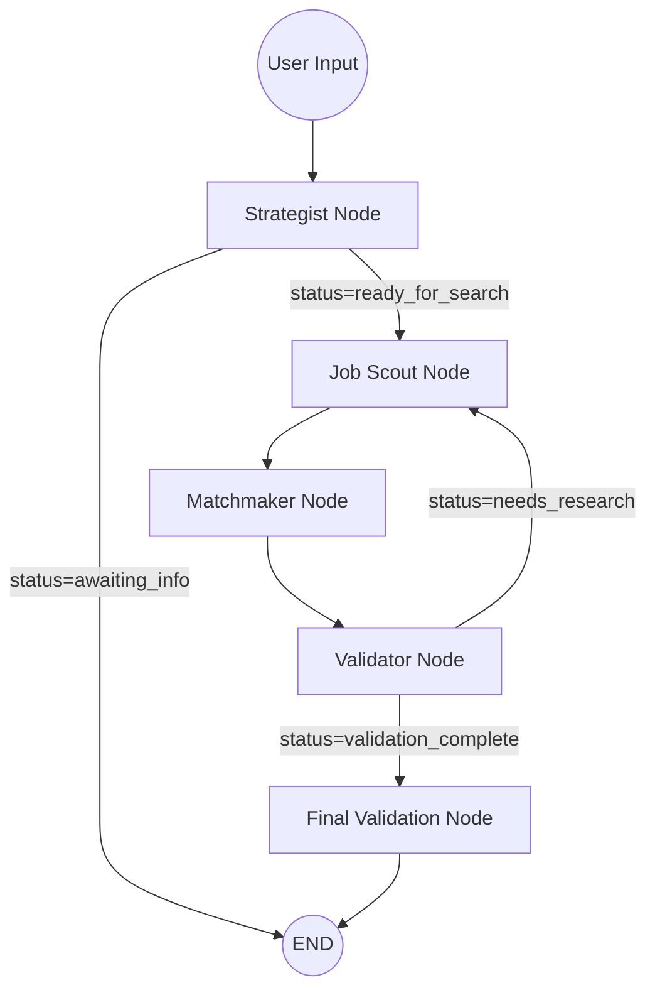

# Orchestrator (LangGraph Multi-Agent System)

This directory contains the **intelligence core** of the Funds Search system. It uses **LangGraph** to orchestrate a multi-agent workflow that intelligently matches job candidates with vacancies through a sophisticated pipeline of specialized AI agents.

## 🏗️ Architecture Overview

The system is built as a **stateful workflow** using LangGraph, where specialized agents collaborate to:
1. **Extract** user preferences from conversations and CVs
2. **Search** for matching vacancies using vector similarity and metadata filters
3. **Analyze** matches with detailed scoring and explanations
4. **Validate** results against hard user requirements

The workflow is **self-correcting**: if validation finds violations, the system automatically adjusts search parameters and re-searches.

```
┌─────────────┐
│   User      │
│  Messages   │
└──────┬──────┘
       │
       ▼
┌─────────────────────────────────────────────────────────────┐
│                    LangGraph Workflow                        │
│                                                              │
│  ┌──────────┐      ┌──────────┐      ┌──────────┐         │
│  │Strategist│─────▶│Job Scout │─────▶│Matchmaker│         │
│  │  Node    │      │   Node   │      │   Node   │         │
│  └────┬────┘      └──────────┘      └────┬─────┘         │
│       │                                   │                │
│       │                                   ▼                │
│       │                            ┌──────────┐            │
│       │                            │Validator │            │
│       │                            │   Node   │            │
│       │                            └────┬─────┘            │
│       │                                  │                  │
│       └──────────────────────────────────┘                  │
│                    (conditional loop)                        │
└─────────────────────────────────────────────────────────────┘
       │
       ▼
┌─────────────┐
│   Results   │
└─────────────┘
```

## 📊 State Schema

The entire workflow operates on a shared `AgentState` that flows through all nodes:

```python
class AgentState(TypedDict):
    messages: Annotated[List[AnyMessage], add_messages]  # Chat history
    user_profile: UserProfile                            # Candidate profile
    cv_text: Optional[str]                               # Editable CV content
    is_cv_attached: bool                                 # CV attached in UI
    candidate_pool: List[Vacancy]                        # Found vacancies
    match_results: List[Dict]                            # Match analyses
    search_params: Dict                                  # Search configuration
    status: str                                          # Current workflow stage
    missing_info: List[str]                              # Missing field ids
    missing_questions: List[str]                         # Human questions
    internal_feedback: Optional[Dict[str, Any]]          # Agent feedback
    violations: Optional[List[Dict[str, Any]]]           # Validation violations
    search_failed_reason: Optional[str]                  # Reason for 0 results
```

### UserProfile Structure

```python
class UserProfile(BaseModel):
    summary: str                     # Profile summary
    skills: List[str]                # Technical skills
    experience_years: int            # Years of experience
    location_pref: str               # Preferred location
    salary_expectation: int          # Desired salary
    salary_min: int                  # Minimum salary filter
    company_stage_pref: List[str]    # Preferred stages
    target_seniority: str            # Target seniority
    industries: List[str]            # Preferred industries
    skip_questions: bool             # Skip clarifying questions
```

## 🔄 Workflow Flow

### Complete Graph Flow



## 🧩 Node Details

### 1. Strategist Node 🕵️‍♂️

**File**: `graph/nodes.py::strategist_node`

**Purpose**: Profile Builder & Information Gatherer

**What it does**:
- Analyzes chat messages and attached CV/resume text
- Extracts candidate information (skills, experience, preferences)
- Updates `UserProfile` incrementally (preserves existing data)
- Checks profile completeness for search readiness
- Generates missing field ids and human questions for missing critical information

**Input**:
- `messages`: Chat history with user messages
- `user_profile`: Existing profile (if any)

**Output**:
- `user_profile`: Updated/created profile
- `status`: `"ready_for_search"` or `"awaiting_info"`
- `missing_info`: List of missing field ids if profile incomplete
- `missing_questions`: Human-friendly questions if profile incomplete

**Key Logic**:
```python
# Checks if profile has:
# - At least one skill (key tech stack)
# - Experience years
# - Location preference
# - Salary expectation and industries are optional

if profile_complete:
    status = "ready_for_search"
else:
    status = "awaiting_info"
    missing_info = missing_fields
    missing_questions = generate_questions(missing_fields)
```

**Agent Used**: `TalentStrategistAgent` (from `agents/talent_strategist.py`)

**Conditional Routing**:
- `"ready_for_search"` → Continue to `job_scout`
- `"awaiting_info"` → End workflow, wait for user input

---

### 2. Job Scout Node 🛰️

**File**: `graph/nodes.py::job_scout_node`

**Purpose**: Search Query Architect & Executor

**What it does**:
- Builds a semantic query directly from `user_profile` (summary + top skills)
- Calls `search_vacancies_tool` directly (no LLM tool planning in this node)
- Builds metadata filters (location, industry, salary_min, company_stage)
- Emits `internal_feedback` when it skips search or gets 0 results

**Input**:
- `user_profile`: Candidate profile
- `search_params`: Existing params (if from validator adjustment)

**Output**:
- `search_params`: Complete search configuration
- `candidate_pool`: List of `Vacancy` objects
- `status`: `"search_complete"`, `"no_results"`, or `"awaiting_info"`

**Key Logic**:
```python
# Build query from profile
query_parts = []
if user_profile.summary:
    query_parts.append(user_profile.summary)
if user_profile.skills:
    query_parts.append(" ".join(user_profile.skills[:8]))
query = " ".join(query_parts).strip()

tool_result = search_vacancies_tool.invoke({
    "query": query,
    "location": location,
    "industry": industries,
    "salary_min": salary_min,
    "company_stage": company_stage,
    "top_k": 50,
})
```

**Tool Used**: `search_vacancies_tool` (direct call, no tool-planning LLM)

---

### 3. Matchmaker Node 🤝

**File**: `graph/nodes.py::matchmaker_node`

**Purpose**: Match Analyzer & Scorer

**What it does**:
- Performs **parallel analysis** of all vacancies in `candidate_pool`
- Generates detailed match summaries for each vacancy
- Creates two types of summaries:
  - **Role Match**: Candidate vs Role requirements
  - **Company Match**: Candidate vs Company profile
- Includes evidence quotes from `evidence_map` in summaries
- Sorts results by match score (0-10)

**Input**:
- `user_profile`: Candidate profile
- `candidate_pool`: List of vacancies to analyze

**Output**:
- `match_results`: List of match analyses with scores and summaries
- `status`: `"matching_complete"`

**Key Logic**:
```python
# For each vacancy in candidate_pool (parallel):
async def analyze_vacancy(vacancy, user_profile):
    # 1. Format vacancy context from extracted entities and blocks
    vacancy_context = format_extracted_entities(vacancy.extracted)
    vacancy_context += format_blocks(vacancy.blocks)
    
    # 2. Analyze overall match
    overall_match = await matchmaker.analyze_match(
        vacancy_text=vacancy_context,
        candidate_persona=persona_dict
    )
    # Returns: {"score": 0-10, "analysis": "..."}
    
    # 3. Generate Role-specific summary
    role_summary = f"Match {score}/10: Candidate has {skills}, matching requirement [{requirement}]"
    if evidence_quotes:
        role_summary += f" (Source: FIT block - \"{quote}\")"
    
    # 4. Generate Company-specific summary
    company_summary = f"Company match {score}/10: Company operates in {domains}"
    if evidence_quotes:
        company_summary += f" (Source: CONTEXT block - \"{quote}\")"
    
    return {
        "vacancy_id": ...,
        "overall_score": 0-10,
        "role_match_summary": role_summary,
        "company_match_summary": company_summary,
        "role_score": 0-10,
        "company_score": 0-10,
        ...
    }

# Run all analyses in parallel
results = await asyncio.gather(*[analyze_vacancy(v) for v in candidate_pool])
match_results = sorted(results, key=lambda x: x["overall_score"], reverse=True)
```

**Agent Used**: `MatchmakerAgent` (from `agents/matchmaker.py`)

**Parallel Execution**: Uses `asyncio.gather()` to analyze all vacancies simultaneously

**Evidence Integration**: Extracts quotes from `vacancy.evidence_map` and includes them in summaries with source attribution (e.g., "Source: FIT block")

---

### 4. Validator Node ✅

**File**: `graph/nodes.py::validator_node`

**Purpose**: Quality Auditor & Self-Corrector

**What it does**:
- Audits `match_results` against user's **hard filters**
- Checks for violations:
  - Location (if specified, vacancies must match)
  - Salary (if specified, vacancies must meet minimum)
- Uses `TalentStrategistAgent` in audit mode to analyze violations
- Adjusts `search_params` to fix violations
- Triggers re-search if violations found
- Skips validation when `candidate_pool` is empty and filters were already relaxed

**Input**:
- `user_profile`: Candidate profile with hard filters
- `match_results`: Match analyses to validate
- `candidate_pool`: Original vacancies for cross-reference
- `search_params`: Current search configuration

**Output**:
- `search_params`: Adjusted search parameters (if violations found)
- `status`: `"validation_complete"` or `"needs_research"`
- `missing_info`: Feedback about violations

**Key Logic**:
```python
# 1. Skip validation if no results and filters already relaxed
if candidate_pool_empty and filters_already_relaxed:
    return {"status": "validation_complete"}

# 2. Identify hard filters from user profile
hard_filters = {}
if profile.location_pref:
    hard_filters["location"] = profile.location_pref
if profile.salary_expectation:
    hard_filters["min_salary"] = profile.salary_expectation

# 3. Check each match result for violations
violations = collect_violations(match_results, candidate_pool, hard_filters)

# 4. If violations found, use TalentStrategistAgent to suggest corrections
if violations:
    adjusted_filters = strategist.audit(violations, search_params)
    search_params["filter_params"].update(adjusted_filters)
    status = "needs_research"
else:
    status = "validation_complete"
```

**Agent Used**: `TalentStrategistAgent` (in audit mode)

**Conditional Routing**:
- `"needs_research"` → Loop back to `job_scout` with adjusted params
- `"validation_complete"` → Continue to `final_validation`

**Loop Protection**: Maximum 2 re-search iterations to prevent infinite loops

---

## 🔀 Conditional Routing

### 1. Strategist → Job Scout

**Function**: `should_continue_to_job_scout(state)`

**Logic**:
```python
if state["status"] == "ready_for_search":
    return "continue"  # → job_scout
elif state["status"] == "awaiting_info":
    return "await_info"  # → END
```

**Purpose**: Ensures search only happens when profile is complete enough.

---

### 2. Validator → Job Scout or End

**Function**: `should_research(state)`

**Logic**:
```python
if state["status"] == "needs_research":
    research_count = state["search_params"].get("_research_iterations", 0)
    if research_count >= 2:
        return "complete"  # Stop after 2 attempts
    return "research"  # → job_scout (with adjusted params)
elif state["status"] == "validation_complete":
    return "complete"  # → final_validation
```

**Purpose**: Self-correction loop with protection against infinite iterations.

---

## 📁 Directory Structure

```
apps/orchestrator/
├── graph/
│   ├── __init__.py
│   ├── state.py          # AgentState and UserProfile definitions
│   ├── nodes.py          # All graph node implementations
│   └── builder.py        # Graph construction and compilation
├── agents/
│   ├── base.py           # BaseAgent class
│   ├── talent_strategist.py
│   ├── job_scout.py
│   ├── matchmaker.py
│   └── vacancy_analyst.py
├── prompts/
│   ├── talent_strategist.txt
│   ├── job_scout.txt
│   ├── matchmaker.txt
│   └── ...
├── settings/
│   └── agents.yaml       # Agent configurations (model, temperature, etc.)
├── llm.py                # LLM provider factory
├── workflow.py           # Legacy workflows (for backward compatibility)
└── README.md             # This file
```

## 🚀 Usage

### Running the Graph

```python
from apps.orchestrator.graph.builder import graph

# Initialize state
initial_state = {
    "messages": [HumanMessage(content="I'm looking for remote Python jobs")],
    "user_profile": None,
    "candidate_pool": [],
    "match_results": [],
    "search_params": {},
    "status": "",
    "missing_info": [],
    "missing_questions": [],
}

# Run the graph
result = await graph.ainvoke(initial_state)
```

### LangGraph Studio

The graph is configured for **LangGraph Studio** with:

1. **Configuration**: `langgraph.json` in project root
   ```json
   {
     "dependencies": ["."],
     "graphs": {
       "graph": "apps.orchestrator.graph.builder:graph"
     },
     "env": ".env"
   }
   ```

2. **Interrupt Point**: The graph interrupts before `final_validation` node, allowing you to inspect results in Studio before final completion.

3. **Checkpointing**: Uses `MemorySaver` for state persistence, enabling step-by-step debugging.

**To use Studio**:
```bash
langgraph dev
```

Then open `http://localhost:8123` to visualize and debug the workflow.

## 🔧 Agent Configuration

Agents are configured in `settings/agents.yaml`:

```yaml
talent_strategist:
  provider: deepseek
  model: deepseek-chat
  temperature: 0.3
  prompt_file: talent_strategist.txt

job_scout:
  provider: deepseek
  model: deepseek-chat
  temperature: 0.5
  prompt_file: job_scout.txt

matchmaker:
  provider: deepseek
  model: deepseek-chat
  temperature: 0.4
  prompt_file: matchmaker.txt
```

## 🔄 Data Flow Example

Let's trace a complete execution:

1. **User sends**: "I'm a Python developer with 5 years experience, looking for remote jobs in Fintech"

2. **Strategist Node**:
   - Extracts: `skills=["Python"]`, `experience_years=5`, `location_pref="Remote"`, `industries=["Fintech"]`
   - Checks: Missing `salary_expectation` (optional)
   - Status: `"ready_for_search"` (has skills + experience + location preference)

3. **Job Scout Node**:
   - Builds query from summary + skills (e.g., `"Python Developer Python"`)
   - Filters: `{"location": "Remote", "industry": "Fintech"}`
   - Searches Pinecone → Finds 8 vacancies
   - Status: `"search_complete"`

4. **Matchmaker Node**:
   - Analyzes all 8 vacancies in parallel
   - Generates match summaries with evidence quotes
   - Sorts by score: [9.2, 8.8, 8.5, 7.8, ...] (0–10 scale)
   - Status: `"matching_complete"`

5. **Validator Node**:
   - Checks: All 8 vacancies match `location_pref="Remote"` ✅
   - Checks: All meet salary requirements (if specified) ✅
   - Status: `"validation_complete"`

6. **Final Validation**:
   - Interrupt point for Studio inspection
   - Returns final results

**If violations found** (e.g., one vacancy doesn't match location):
- Validator adjusts `search_params`: tightens `location` filter
- Loops back to Job Scout
- Job Scout uses adjusted params → Finds 7 location-matching vacancies
- Matchmaker re-analyzes → New results
- Validator validates again → All pass ✅

## 🎯 Key Features

1. **Incremental Profile Building**: Strategist merges new information without losing existing data
2. **Self-Correcting Search**: Validator automatically adjusts search parameters if violations found
3. **Parallel Analysis**: Matchmaker analyzes all vacancies simultaneously for speed
4. **Evidence-Based Summaries**: Match summaries include quotes from vacancy descriptions
5. **Conditional Routing**: Smart decisions at each step based on state
6. **Loop Protection**: Maximum iteration limits prevent infinite loops

## 🧪 Testing

Each node can be tested independently:

```python
from apps.orchestrator.graph.nodes import strategist_node, job_scout_node

# Test strategist
state = {"messages": [...], "user_profile": None, ...}
result = await strategist_node(state)

# Test job_scout
state = {"user_profile": UserProfile(...), ...}
result = await job_scout_node(state)
```

## 📝 Notes

- **Legacy Support**: `workflow.py` contains older workflows for backward compatibility
- **CV Processing**: CV text can be attached in messages and will be extracted by strategist
- **Error Handling**: All nodes include comprehensive error handling and logging
- **State Immutability**: LangGraph handles state updates automatically via `add_messages` reducer

## 🔗 Related Documentation

- [LangGraph Documentation](https://langchain-ai.github.io/langgraph/)
- [Pinecone Vector Search](./shared/pinecone_client.py)
- [Vacancy Schema](../src/schemas/vacancy.py)
- [Agent Base Class](./agents/base.py)
