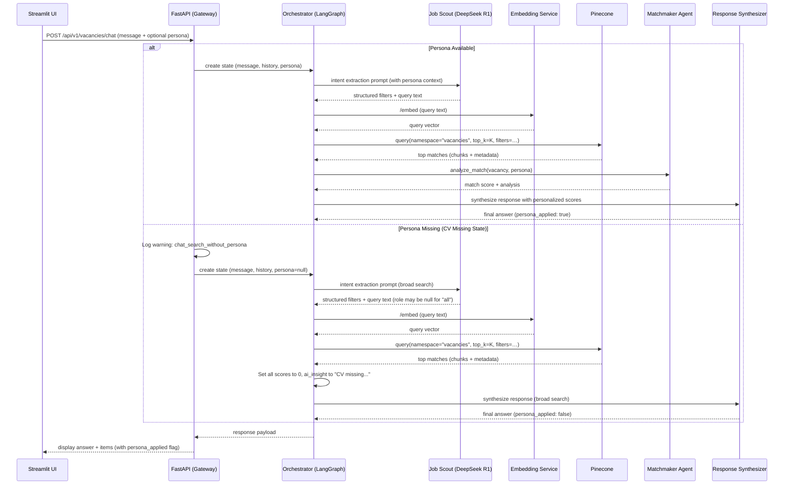
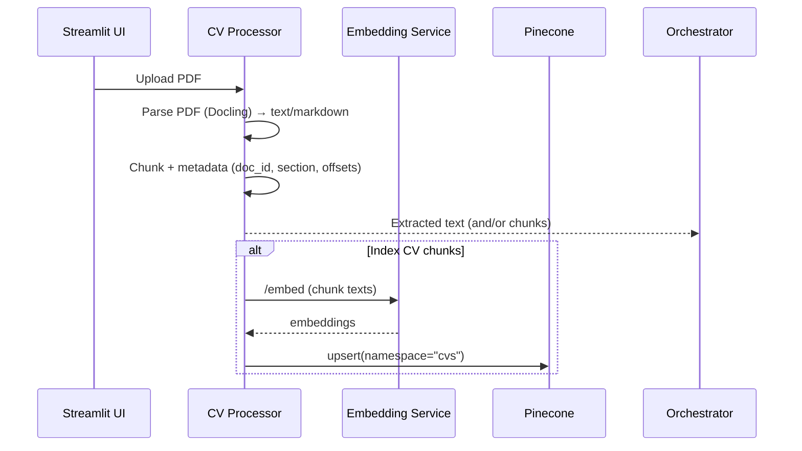
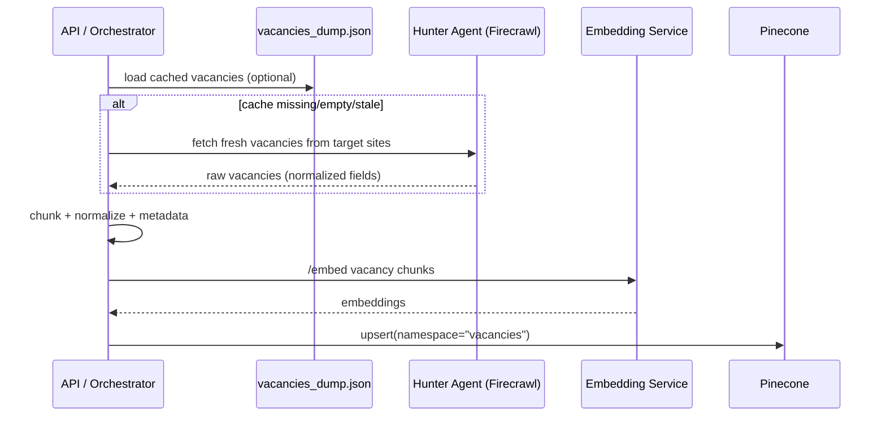

# Architecture Deep Dive

This document expands the root README into a detailed, implementation-oriented view of the system.

## Goals

- Keep the UI conversational while keeping backend behavior **traceable** (schemas, explicit agent boundaries).
- Use a **vector DB** for retrieval and an LLM for **intent extraction + synthesis**.
- Support both **offline/cache** operation and **real-time discovery** (Firecrawl) as a fallback.

---

## System Responsibilities

### Client (Streamlit)
- Chat UI + session history
- CV upload (optional)
- Displays matched roles + explanations

### API (FastAPI)
- Public entrypoint: chat/search/matching endpoints
- Validates requests/responses (Pydantic v2)
- Orchestrates agent flow (LangGraph)

### Orchestrator (LangGraph)
- Converts requests into a **state machine** (retrieval → analysis)
- Calls agents in sequence and stores intermediate artifacts in state:
  - persona (UserPersona)
  - intent filters
  - retrieved context
  - final response / report

### Internal Services
- **Embedding Service (BGE-M3)**: text → vector
- **CV Processor**: PDF → text → chunks (+ optional upsert to Pinecone)

### Data Layer
- **Pinecone**: vector retrieval across namespaces (recommended: `cvs`, `vacancies`)
- **Local Cache**: `vacancies_dump.json` for fast local testing

---

## End-to-End Flow: Chat → Search → Response

---

## CV Processing Flow: Upload → Persona/Index

There are two common modes:
1) **Persona-only**: parse CV → build UserPersona without indexing
2) **Index CV**: parse CV → chunk → embed → upsert to Pinecone (`cvs` namespace)

---

## Vacancy Indexing Flow: Cache / Firecrawl → Index

Vacancy acquisition sources:
- Local JSON cache (`vacancies_dump.json`)
- Real-time fetching via Firecrawl (Hunter Agent)

---

## Orchestration Notes (LangGraph)

Recommended node boundaries:
- **intent_node**: call Job Scout (DeepSeek R1) → filters + query text
- **retrieval_node**: embed query → Pinecone query → collect top-K
- **analysis_node**: Matchmaker (optional stronger model) → MatchingReport / explanations
- **synthesis_node**: Response Synthesizer → UI-ready response

Trigger rules:
- Hunter Agent triggers when:
  - cache is empty OR
  - Pinecone returns near-zero results OR
  - user explicitly asks for “latest / today / this week”

---

## Namespaces & Metadata (Pinecone)

Recommended:
- Single index (e.g., `funds-search`)
- Namespaces:
  - `cvs` for CV/resume chunks
  - `vacancies` for vacancy chunks

Minimum metadata per vector:
- `source_type`: `cv` | `vacancy`
- `doc_id` / `candidate_id` / `vacancy_id`
- `title`, `company`, `url` (for vacancies)
- `chunk_id`, `chunk_index`, `text_offset` (optional but helpful)

---

## Source of Truth

- Schemas: `shared/schemas.py`
- Pinecone client wrapper: `shared/pinecone_client.py`
- Orchestration logic: `apps/orchestrator/`

