# System Architecture

## Overview

The Autonomous Job Hunter is a multi-agent RAG (Retrieval-Augmented Generation) system that helps candidates find ideal roles at VC-backed startups through intelligent agentic workflows. The system uses LangGraph orchestration, semantic embeddings (BGE-M3), and AI reasoning (Gemini) to match candidates with job opportunities.

## System Responsibilities

- **CV Processing**: Parse PDF resumes using Docling, chunk text, generate embeddings, and store in Pinecone namespace `"cvs"`
- **Vacancy Indexing**: Process job descriptions, chunk text, generate embeddings, and store in Pinecone namespace `"vacancies"`
- **Semantic Search**: Use vector similarity search to find relevant job postings based on candidate profiles or search queries
- **AI Matching**: Generate detailed explanations using Gemini LLM explaining why vacancies fit candidates
- **Multi-Agent Workflows**: Orchestrate Talent Strategist, Web Hunter, and Deep Match Analyst agents using LangGraph

## Data Flows

### Chat → Intent → Embed → Pinecone Retrieve → Synthesis

### CV Upload → Docling Parse → Chunk → Embed → Upsert (namespace=cvs)

```mermaid
sequenceDiagram
    participant User
    participant WebUI
    participant CVProc
    participant Embedding
    participant Pinecone
    
    User->>WebUI: Upload PDF
    WebUI->>CVProc: POST /process-cv
    CVProc->>CVProc: PDF → Markdown (Docling)
    CVProc->>CVProc: Chunk (1000 chars, 800 overlap)
    CVProc->>Embedding: POST /embed
    Embedding-->>CVProc: Embeddings (1024-dim)
    CVProc->>Pinecone: Store vectors (namespace: "cvs", type: "cv")
    CVProc-->>WebUI: Success
    WebUI-->>User: CV Processed
```

### Vacancy Indexing (Cache and/or Firecrawl) → Chunk → Embed → Upsert (namespace=vacancies)

### Matching Pipeline (LangGraph Workflow)

## LangGraph Orchestration Patterns

### Search Workflow Graph

The search workflow handles natural language job search queries:

1. **Entry Node**: Receives search query
2. **Retrieval Node**: 
   - Embeds query using BGE-M3
   - Searches Pinecone `"vacancies"` namespace
   - Returns top 10 job matches with similarity scores
3. **Analysis Node**:
   - Uses Gemini to analyze each match
   - Generates reasoning explaining relevance
   - Reranks results based on AI analysis
4. **End Node**: Returns ranked `MatchResult` objects

**State Schema (`OrchestratorState`)**:
- `query`: Search query string
- `query_vector`: Embedding vector for the query
- `search_request`: Structured `SearchRequest` object
- `retrieved_jobs`: List of `Job` objects from Pinecone
- `job_scores`: Similarity scores from vector search
- `match_results`: Final list of `MatchResult` objects

### Matching Workflow Graph

The matching workflow matches candidates with vacancies:

**Graph Structure**: `Entry → talent_strategist → web_hunter → fetch_candidate → search_vacancies → rerank_and_explain → End`

**State Schema (`MatchingState`)**:
- `candidate_id`: Input candidate identifier
- `candidate_embedding`: Retrieved embedding vector (average of CV chunks)
- `user_persona`: `UserPersona` object built from Talent Strategist interview
- `raw_scraped_data`: List of raw job data discovered by Web Hunter agent
- `retrieved_vacancies`: List of vacancy search results
- `vacancy_scores`: Similarity scores from Pinecone
- `match_results`: Final list of `VacancyMatchResult` objects (legacy format)
- `final_reports`: List of `MatchingReport` objects (new structured format)
- `top_k`: Number of results to return

**Nodes**:

1. **`talent_strategist_node`** (Placeholder): Processes interview/conversation context to build `UserPersona`. Extracts:
   - Technical skills
   - Career goals
   - Startup stage preferences (Seed, Series A, etc.)
   - Cultural fit preferences

2. **`web_hunter_node`** (Placeholder): Uses Firecrawl to discover job postings from VC fund websites. Scrapes and processes job listings, storing `raw_scraped_data` for further processing.

3. **`fetch_candidate_node`**: 
   - Fetches candidate embedding from Pinecone namespace `"cvs"`
   - Computes average of all CV chunks
   - Normalizes the embedding vector
   - Raises error if candidate not found

4. **`search_vacancies_node`**: 
   - Uses candidate embedding to search Pinecone namespace `"vacancies"`
   - Applies metadata filter: `type: 'vacancy'`
   - Retrieves top-k results with similarity scores

5. **`rerank_and_explain_node`**: 
   - For each vacancy, uses Gemini AI to:
     - Analyze why the vacancy fits the candidate
     - Generate detailed reasoning
     - Explain skills alignment and career benefits
   - Creates `VacancyMatchResult` objects with scores and reasoning
   - (Future: Generate `MatchingReport` objects with structured analysis)

**AI Prompting**: Uses `langchain-google-genai` (Gemini 2.5 Flash) with system prompt focused on recruiter-style analysis explaining skills match, experience alignment, career growth, and potential gaps.

## Namespaces & Metadata

### Pinecone Namespaces

- **`"cvs"`**: Stores candidate CV/resume embeddings
  - Metadata: `type: 'cv'`, `user_id: str`, `chunk_index: int`
  
- **`"vacancies"`**: Stores job posting embeddings
  - Metadata: `type: 'vacancy'`, `vacancy_id: str`, `chunk_index: int`

### Metadata Filtering

All vector searches use metadata filters to ensure type safety:
- CV searches: `{"type": {"$eq": "cv"}}`
- Vacancy searches: `{"type": {"$eq": "vacancy"}}`

### Chunking Strategy

- **Chunk Size**: 1000 characters
- **Overlap**: 800 characters (for context preservation)
- **Embedding Model**: BGE-M3 (1024 dimensions)
- **Normalization**: L2-normalized vectors for cosine similarity

## Key Implementation Details

| Aspect | Implementation |
|--------|----------------|
| **Schemas** | Single source of truth: `shared/schemas.py` (Pydantic v2) |
| **CV Processing** | `run_in_threadpool` for Docling (non-blocking async) |
| **Image Size** | API: multi-stage build (4GB → <500MB) |
| **Pinecone** | Namespaces: `"cvs"` (resumes), `"vacancies"` (jobs) Metadata filter: `type: 'cv'` or `type: 'vacancy'` |
| **Chunking** | 1000 chars, 800 overlap |
| **Embeddings** | BGE-M3 (1024 dimensions), L2-normalized |
| **LLM** | Gemini 2.5 Flash (reasoning & reranking) |
| **Candidate Embedding** | Average of all CV chunks, normalized |
| **Vector Search** | Cosine similarity with metadata filters |

## System Architecture Diagram

```mermaid
graph TB
    subgraph "Client"
        User[👤 Recruiter] --> WebUI[📊 Streamlit UI<br/>:8501]
    end
    
    subgraph "API Gateway"
        WebUI --> API[🚀 FastAPI<br/>:8000]
        WebUI -->|Upload CV| CVProc[📄 CV Processor<br/>:8002]
    end
    
    subgraph "Orchestration"
        API -->|Search/Match| Orch[🔄 LangGraph<br/>Orchestrator]
        Orch -->|1. Retrieve| RetNode[🔍 Retrieval Node]
        Orch -->|2. Analyze| AnaNode[🤖 Analysis Node]
    end
    
    subgraph "Services"
        RetNode -->|Embed Query| EmbSvc[🧮 Embedding Service<br/>BGE-M3 :8001]
        RetNode -->|Vector Search| PC[(📦 Pinecone<br/>Vector DB)]
        CVProc -->|Get Embeddings| EmbSvc
        CVProc -->|Store Vectors| PC
    end
    
    subgraph "AI"
        AnaNode -->|Reasoning| Gemini[🧠 Gemini 2.5 Flash<br/>LLM]
    end
    
    subgraph "Data Models"
        Schemas[📋 Pydantic Schemas<br/>shared/schemas.py]
        Schemas -.->|Used by| API
        Schemas -.->|Used by| Orch
        Schemas -.->|Used by| CVProc
    end
    
    style User fill:#e1f5ff
    style WebUI fill:#c8e6c9
    style API fill:#c8e6c9
    style Orch fill:#fff9c4
    style EmbSvc fill:#f3e5f5
    style CVProc fill:#f3e5f5
    style PC fill:#ffccbc
    style Gemini fill:#ffccbc
    style Schemas fill:#e8f5e9
```

---

[← Back to README](../README.md)

